# AgenticAI Manufacturing — Multi-Domain Hybrid GraphRAG Copilot

Evidence-grounded, schema-driven diagnostic copilot for industrial knowledge work.

Three live domains ship out of the box (**manufacturing · EV manufacturing · aviation**), and new domains are added by dropping a `schemas/<domain>.yaml` — no Python edits required. The framework wraps a hybrid retrieval engine (Qdrant + BM25 + knowledge-graph fusion with RRF and a cross-encoder reranker), a two-stage answer pipeline (cause ranking → structured procedure drafting), a critic-driven self-correction loop, and a production HITL approval gate with role-based access control on both **approvals** and **document reads**.

| Mode                  | Retrieval                       | LLM | Critic | Notes                                                  |
| --------------------- | ------------------------------- | --- | ------ | ------------------------------------------------------ |
| **Quick Search**      | Qdrant only (Clarifier-aware)   | No  | No     | LLM-free fallback; works without `OPENAI_API_KEY`      |
| **Diagnostic Copilot**| BM25 + Qdrant + Graph + RRF + Rerank | Yes | Yes | The primary path; cause-rank + procedure drafter + HITL |
| **Classical RAG**     | Qdrant only                     | Yes | No     | Baseline for benchmarking                              |
| **Direct LLM**        | _none (baseline)_               | Yes | No     | Baseline for benchmarking                              |

Every chat surface (Streamlit `💬 Chat`, Next.js chat page, `/api/chat`) is driven by **`ChatAgent`** — multi-turn slot filling on top of the Clarifier. It auto-corrects domain jargon, asks one targeted follow-up at a time when required entities (equipment, metric, time period) are missing, then runs Diagnostic (or Quick Search if no LLM key is configured).

---

## Table of Contents

1. [Live domains](#live-domains)
2. [Quick start (5 minutes)](#quick-start-5-minutes)
3. [Architecture at a glance](#architecture-at-a-glance)
4. [Capabilities](#capabilities)
5. [The schema contract — `schemas/<domain>.yaml`](#the-schema-contract--schemasdomainyaml)
6. [Onboarding a new domain](#onboarding-a-new-domain)
7. [Knowledge graph — three-tier model (kgrag L1–L3)](#knowledge-graph--three-tier-model-kgrag-l1l3)
8. [LLM routing — `core/llm_router.py`](#llm-routing--corellm_routerpy)
9. [HITL approval gate · RBAC · Document ACLs](#hitl-approval-gate--rbac--document-acls)
10. [Advanced patterns (seven flags)](#advanced-patterns-seven-flags)
11. [Running the stack](#running-the-stack)
12. [Configuration reference](#configuration-reference)
13. [Directory map](#directory-map)
14. [Design assets](#design-assets)
15. [Roadmap, ADRs, and changelog](#roadmap-adrs-and-changelog)
16. [License](#license)

---

## Live domains

Three production-ready domains ship in the repo. Each gets its own Qdrant collection, KG file, and per-domain `prompts:` / `safety:` / `clarifier:` / `procedure:` overrides (see [The schema contract](#the-schema-contract--schemasdomainyaml)).

| Domain id          | Display label       | Corpus shape                                        | Schema                              |
| ------------------ | ------------------- | --------------------------------------------------- | ----------------------------------- |
| `manufacturing`    | 🏭 Manufacturing    | Plant-floor maintenance manuals, work orders, alarms| `schemas/manufacturing.yaml`        |
| `ev_manufacturing` | 🔋 EV Manufacturing | EV battery cell / motor / hairpin-stator processes  | `schemas/ev_manufacturing.yaml`     |
| `aviation`         | ✈️ Aviation         | FAA AMT chapters, ASRS-style work orders            | `schemas/aviation.yaml`             |

Switch the active domain at runtime in any UI: Streamlit sidebar dropdown, Next.js header pill, or via the CLI flag `python main.py --domain <name>`. The FastAPI endpoint `GET /api/domains` enumerates everything that auto-discovered.

---

## Quick start (5 minutes)

```bash
# 1. Clone and enter
git clone <this-repo> AgenticAI_Manufacturing && cd AgenticAI_Manufacturing

# 2. Python deps (Python 3.10+)
python -m venv .venv && source .venv/bin/activate
pip install -r requirements.txt

# 3. Optional: Next.js front-end
(cd web && npm install)

# 4. Env config — only secrets + infra URLs live here
cp .env.example .env
# Set OPENAI_API_KEY for cloud mode. Without it the LLM router stays on local Ollama;
# Quick Search continues to work either way.

# 5. Boot the full stack (FastAPI + Streamlit + Next.js) in the background
./run.sh
```

After `./run.sh` returns, three surfaces are live:

| Surface            | URL                                                | Default |
| ------------------ | -------------------------------------------------- | ------- |
| **Next.js chat UI**| http://localhost:3000                              | primary |
| **Streamlit**      | http://localhost:8501                              | analytics, approvals, comparison tabs |
| **FastAPI**        | http://localhost:8000  · docs at `/docs`           | JSON HTTP for any client |

Sign in with one of the seeded demo accounts (e.g. `alice@plant.local` / `operator123` — full list under [HITL · RBAC](#role-based-approvals)).

Tear everything down with `./stop.sh`; check liveness with `./status.sh`.

---

## Architecture at a glance

The platform pivot is the **schema-driven seam**: a single per-domain YAML drives KG ontology, retrieval routing, LLM prompts, safety keywords, clarifier behaviour, and UI copy. Everything else is framework code.

```mermaid
flowchart LR
    %% ─── per-domain artefact ─────────────────────────────────
    subgraph Authoring["Per-domain authoring (one YAML)"]
        SY["schemas/&lt;domain&gt;.yaml<br/>· KG ontology (entity_types, edge_types)<br/>· prompts (answer / critic / procedure / cause-rank)<br/>· safety (high_risk_keywords)<br/>· clarifier (intent_patterns, slot_templates)<br/>· procedure (enabled, trigger_intents)"]
    end

    %% ─── per-domain stores ───────────────────────────────────
    SY --> QC["Qdrant collection<br/>&lt;domain&gt;_corpus"]
    SY --> KG["Knowledge graph (NetworkX)<br/>knowledge_graph.&lt;domain&gt;.json"]
    SY --> DP["core/domain_prompts.py<br/>(loads prompts + safety)"]

    %% ─── request path ────────────────────────────────────────
    U([User query]) --> CL["Clarifier + Query corrector<br/>(domain-aware)"]
    CL --> RT["Hybrid retriever<br/>BM25 + Qdrant + Graph → RRF → cross-encoder rerank"]
    QC --> RT
    KG --> RT
    RT --> CR["Cause ranker (intent-gated)"]
    CR --> PD["Procedure drafter (two-stage)"]
    DP --> CR
    DP --> PD
    PD --> GR["Guardrails (citation + safety regex)"]
    GR --> CT["Critic loop (LLM verdict + retry)"]
    CT --> HITL{"criticality_check<br/>(risk + safety + $)"}
    HITL -->|low risk| ANS([Answer + citations])
    HITL -->|high risk| HUMAN["human_approval (interrupt)<br/>maker-checker, role-gated"]
    HUMAN --> ANS

    %% ─── LLM routing ─────────────────────────────────────────
    LLM["core/llm_router.py<br/>6 task roles · 2 backend profiles<br/>(answer · procedure · critic · analyze · tool · onboarding)"]
    CR -.task: analyze.-> LLM
    PD -.task: procedure.-> LLM
    CT -.task: critic.-> LLM
```



The deep canonical diagrams (eight landscape pages) live in `system_design/system_architecture.pdf`, regenerable from `system_design/generate_diagram.py`. See [Design assets](#design-assets) for the rest of the deck.

---

## Capabilities

### Multi-domain framework
- **Schema-driven onboarding** — `schemas/<domain>.yaml` is the single per-domain edit. KG ontology + prompts + safety + clarifier + procedure blocks all live there.
- **Auto-discovery** — every UI surface (Streamlit sidebar, Next.js header, `/api/domains`) picks up any new schema dropped into `schemas/` on next restart.
- **Per-domain isolation** — each domain gets its own Qdrant collection (`<domain>_corpus`), KG file (`knowledge_graph.<domain>.json`), input directory (`doc_pipeline/input_docs/<domain>/`), and index name. Switching domains never bleeds context across collections.
- **Two onboarding paths** — `scripts/onboard_domain.sh` for ops (drop schema + docs, rebuild), or the LLM wizard (`core/onboarding_agent.py`) for new schemas authored from a sample corpus. See [Onboarding a new domain](#onboarding-a-new-domain).

### Retrieval & knowledge graph
- **Vector store:** Qdrant (embedded on-disk by default, remote via `QDRANT_URL`). First-class payload filtering powers the document-ACL layer.
- **Embeddings:** `BAAI/bge-small-en-v1.5` (384-dim) — strong on technical / industrial retrieval.
- **Reranker (on by default):** cross-encoder `BAAI/bge-reranker-base`, RRF + cross-encoder blend (`RERANK_BLEND_WEIGHT=0.7`, min-max normalised so no leg dominates).
- **Three-way fusion:** BM25 (`rank-bm25` with pure-Python fallback) + Qdrant vector + Graph retriever, fused via Reciprocal Rank Fusion with edge-prior boosting.
- **Parallel retrieval (on by default):** BM25/vector/graph fan out across a thread pool — ~30% latency cut on the diagnostic path. Per-leg timeout via `PARALLEL_RETRIEVAL_TIMEOUT_S`.
- **Three-tier KG (kgrag L1–L3):** schema validation at build time · provenance-stamped extractors (Code → Metadata → Narrative, decreasing confidence) · gap detector + HITL writeback (`record_human_edge`). See [Knowledge graph](#knowledge-graph--three-tier-model-kgrag-l1l3).
- **Provenance-aware retrieval:** `KG_RETRIEVAL_MIN_CONFIDENCE` (default 0.0 = legacy; bump to 0.95 in production to drop narrative-extracted edges).

### Generation & critic loop
- **Two-stage generation:** cause ranking → structured procedure drafting (`{steps: [{step, action, citations}]}`). Per-step citations make the answer navigable; the rendered Markdown becomes the legacy `answer` string for backward compatibility with the critic + guardrails.
- **Intent-gated cause ranker:** only runs on troubleshooting / failure-analysis intents (`troubleshoot`, `diagnos`, `root_cause`, `failure`, `fault`, `repair`, …). Skipped queries surface a `cause_ranking.skipped` reason and pay zero cost.
- **Fixed cause taxonomy (optional):** set `CAUSE_TAXONOMY=BearingWear,SealLeak,…` to constrain the ranker's output to an allow-list — anti-hallucination guarantee for fault dictionaries that need to be exhaustive.
- **Critic loop:** verdict / confidence / issues / suggestion → retry with `RETRY_MODEL` up to `MAX_CRITIC_RETRIES`. The same loop runs in either the procedural orchestrator or the LangGraph `StateGraph` (`USE_LANGGRAPH=true`).
- **Guardrails (on by default):** citation-required + safety-regex post-processor (`core/guardrails.py`). Hard-blocks unsafe answers (LOTO bypass, energised electrical work), flags fabricated citations, folds soft violations back into the retry loop.
- **Streaming:** `LangGraphOrchestrator.stream_query()` and `/api/chat/stream` (SSE) yield per-node updates. Streamlit and Next.js render incrementally.

### Onboarding (new-domain authoring)
- **CLI path** — `scripts/onboard_domain.sh --domain X --schema X.yaml --docs dir/` stages the schema, copies input docs, runs `main.py --rebuild --domain X --no-llm`, and reports node / edge / vector counts. No LLM required.
- **LLM wizard** — `core/onboarding_agent.py` drives a four-stage pipeline:
  - **Stage A** characterises the corpus (deterministic vocab miner + LLM cluster labelling, picks one of 8 archetypes — `maintenance_manual` / `process_tutorial` / `regulatory_compliance` / `clinical_reference` / `financial_report` / `legal_document` / `design_specification` / `general_technical`)
  - **Stage B** drafts the schema YAML using the archetype's skeleton (not the manufacturing template)
  - **Stage C** runs 7 validation gates (loader-parses, round-trip extraction, self-check, pydantic on new blocks, vocab grounding ≥ 40%, example-ID corpus presence, id_pattern corpus matches)
  - **Stage D** repairs with the specific gate errors fed back (≤ 2 retries)
- **Deterministic vocab miner** (`core/vocab_miner.py`) — spaCy NP extraction + bge embedding + agglomerative clustering over the full corpus. The LLM only labels clusters, not extracts them.

### Safety — HITL · RBAC · Document ACLs
- **HITL approval gate** (`USE_HITL=true`) — `criticality_check` + `human_approval` LangGraph nodes pause high-risk answers and over-threshold purchase requests at a `langgraph.types.interrupt(...)`. Durable SQLite checkpointer (`HITL_CHECKPOINT_BACKEND=sqlite`) persists paused state across restarts.
- **Role catalogue** — 9 roles (`operator`, `shift_supervisor`, `maintenance_planner`, `maintenance_engineer`, `ehs_officer`, `quality_engineer`, `buyer`, `procurement_manager`, `plant_manager`). Each pending approval carries a `required_roles` list (`core/rbac.required_roles_for`).
- **Maker-checker enforcement** — the user who submitted a query cannot self-approve. HTTP 409 on the resume endpoint when the maker tries; HTTP 403 when the role isn't on the allow-list.
- **Document ACLs** — three-tier classification (`public` / `restricted` / `confidential`) on every chunk, enforced via a `ContextVar`-scoped retriever filter so role propagates without parameter plumbing. Operator asking about confidential financials gets an honest "no evidence" instead of a leak.
- **Append-only audit log** (`core/audit_log.py`) — every decision is logged with approver_user_id + approver_role + comments. Surfaced via `/api/audit`.

### Tools (ERP · MES · SAP · DB)
- **Read tools** (`get_inventory`, `get_work_order_status`) run inline before the answer LLM and feed their outputs into the prompt.
- **Write tools** (`create_purchase_order`, `create_work_order`) are queued at the **same** HITL gate before they touch the system of record.
- **Pluggable backends** — ship a `MockToolBackend` for demos; subclass `ToolBackend` in `core/tools/registry.py` to wire SAP / Oracle / Maximo.
- **Planner** — `core/tools/planner.py` is rule-first; an LLM-backed planner (`TOOL_PLANNER_USE_LLM=true`) handles the long tail.

### Eval harness
- **RAGAS-style metrics:** `faithfulness`, `answer_relevancy`, `context_precision`, `citation_accuracy`, `guardrail_pass_rate`.
- **Hard-target metrics:** `top_cause_match_rate`, `subsystem_match_rate` — only counted on records that declared an expectation. Brutal-but-honest; soft metrics can drift up while diagnostic accuracy stays low.
- **Run it:** `python -m comparison.eval.run --pipelines hybrid_graphrag classical_rag direct_llm`. Writes Markdown + JSON reports.

### UI surfaces
- **Streamlit** (`app.py`) — eight tabs: `💬 Chat` · `🔍 Quick Search` · `🩺 Diagnostic Copilot` · `⚖️ Comparison` · `🔗 Knowledge Graph` · `📋 Approvals` · `🌱 Onboard Domain` · `🔄 Architecture & Cost`.
- **Next.js 14 + Tailwind** (`web/`) — Claude-style chat at `/`, plus role-aware dashboards (`📊 My Requests` and `🛡️ Approvals` — the Approvals tab is gated by `isCheckerRole(role)`).
- **FastAPI** (`api/server.py`) — see [Configuration reference](#api-endpoints) for the full route list.
- **CLI** (`main.py`) — `--query` / `--diagnostic` / `--compare` / `--rebuild` / `--domain` / `--no-llm` / `--json`.

---

## The schema contract — `schemas/<domain>.yaml`

A single YAML file owns everything that's domain-specific. Framework code never references domain names directly; instead it loads this contract through `config.SCHEMA_PATHS` and `core/domain_prompts.py`.

### Top-level structure

```yaml
version: 1
domain: ev_manufacturing
display:
  label: EV Manufacturing
  emoji: "🔋"
  color: "#0EA5E9"

# ── kgrag L1 ontology ────────────────────────────────────────────────────
entity_types:
  - name: Equipment
    id_pattern: '^(?:EV|MTR|BAT)-[A-Z0-9]{1,3}-?\d{2,4}$'
    case_sensitive: false
  - name: Component
    vocabulary: [hairpin stator, rotor, axial flux motor, lithium-ion battery, …]
  # … Symptom (open), Cause (closed vocab), Procedure (open), …

edge_types:
  - name: HAS_COMPONENT
    source: Equipment
    target: Component
    min_cardinality: 0
    max_cardinality: null
  # … HAS_SYMPTOM, HAS_CAUSE, RESOLVED_BY, REQUIRES_PART, …

traversal_routes:
  - name: symptom_to_fix
    path: [Symptom, Cause, FailureMode, Procedure]

# ── Per-domain LLM behaviour (NEW — pydantic-validated) ────────────────────
prompts:
  persona: "EV manufacturing process copilot"
  answer_system: "You are …"
  critic_rules: "Reject answers that …"
  procedure_system: "Draft a procedure. Safety preconditions include …"
  cause_rank_system: "Rank the top {top_k} causes. {taxonomy_clause}"
  retry_system: "Critic feedback: {critic_feedback}. Revise …"
  classify_system: "Classify intent into one of: process_lookup, defect_diagnosis, …"
  risk_grader_system: "…"
  risk_grader_user: "…"

safety:
  high_risk_keywords: [thermal runaway, dendrite, electrolyte leak, …]

clarifier:
  intent_patterns:
    - intent: TROUBLESHOOTING
      patterns: ['\bdefect\b', '\bdiagnos', '\broot cause\b']
      boost: 0.85
  slot_templates:
    - intent: TROUBLESHOOTING
      slots:
        - {name: equipment, entity_types: [Equipment], required: true, prompt: "Which line or station?"}

procedure:
  enabled: true
  trigger_intents: ["troubleshoot", "diagnos", "procedure"]

# ── UI affordances ─────────────────────────────────────────────────────────
placeholder: "Ask about EV battery / motor / stator processes…"
empty_state:
  heading: "EV Manufacturing copilot"
  blurb: "Ground answers in your production-line corpus."
examples:
  - "What causes hairpin shorts during stator winding?"
  - "Lithium battery formation cycle — typical voltage curve?"
  # 6–10 entries, mix metric / lookup / diagnostic / procedure intents
```

### The four new blocks — what they unlock

| Block         | Validated by                | Used by                                              |
| ------------- | --------------------------- | ---------------------------------------------------- |
| `prompts:`    | pydantic (`extra='forbid'`) | every LLM call site through `core/domain_prompts.py` |
| `safety:`     | pydantic                    | `criticality_check`, guardrails, risk grader        |
| `clarifier:`  | pydantic                    | `doc_pipeline/clarifier_agent.py`                    |
| `procedure:`  | pydantic (StrictBool)       | the two-stage drafter — controls per-domain on/off  |

**Validation is strict.** `core/schema_validator.py` catches:
- Top-level typos (`prommpts:` / `saftey:`) — fuzzy-match warning
- Inside-block typos (`high_risk_keyword:` singular) — pydantic `extra='forbid'` error
- String-coerced booleans (`enabled: "false"`) — `StrictBool` error
- Malformed `{placeholder}`s in `retry_system` / `cause_rank_system` that would explode at `.format()` time

Existing kgrag blocks (`entity_types`, `edge_types`, `traversal_routes`, `corrections`, `display`, …) are validated by `core/kg/schema.py` instead — the two validators don't overlap.

Falls back to manufacturing defaults block-by-block — a partial schema is valid and ships sane behaviour.

---

## Onboarding a new domain

### Path A — CLI (you already have a schema)

```bash
scripts/onboard_domain.sh \
  --domain medical \
  --schema /tmp/medical.yaml \
  --docs   /tmp/medical_pdfs/
```

What it does, in order:

1. Validates the domain id (lowercase a-z / 0-9 / underscore)
2. Copies `--schema` → `schemas/<domain>.yaml`
3. Parses the schema (`core.kg.schema.load_schema`) and confirms the `domain:` field matches
4. Confirms auto-discovery picked it up in `config.DOMAINS`
5. Recursively copies `--docs/*` → `doc_pipeline/input_docs/<domain>/`
6. Runs an optional `--convert` shell command (JSONL/CSV → .txt etc.; the literal `OUTDIR` is substituted)
7. Builds the per-domain Qdrant collection + KG: `python main.py --rebuild --domain <name> --no-llm`
8. Prints node / edge / vector counts and the resulting registry

Flags: `--rebuild-only` skips schema + docs staging; `--keep-llm` opts back into the orchestrator init (default is `--no-llm` for speed). Exit codes: `0` success · `64` usage · `65` missing input · `70` rebuild failed.

### Path B — LLM wizard (you have a corpus, need a schema)

```python
from core.onboarding_agent import analyze, save_schema

docs = [open(p).read() for p in glob("/tmp/clinical_pdfs/*.txt")]
result = analyze(domain_id="clinical_ref", docs=docs, domain_hint="clinical reference")

if result.ready_to_generate and result.validation["all_passed"]:
    save_schema("clinical_ref", result.yaml)
else:
    # Ask the user the result.follow_up_questions, append answers, call analyze() again
    print(result.follow_up_questions)
```

Pipeline overview:

```
                  ┌── deterministic vocab miner ───┐
docs ─────────────┤  spaCy NP + bge + clustering   ├──► ~40 grounded clusters
                  └────────────────────────────────┘
                                  │
                                  ▼
Stage A  ─ _characterize_corpus()       archetype + cluster → entity-type labelling
Stage B  ─ _draft_schema()              YAML draft using the archetype skeleton
Stage C  ─ _validate_schema()           Gates 1–7
Stage D  ─ _repair_schema()             ≤ MAX_REPAIR_ATTEMPTS retries with gate errors fed back
```

**The 7 gates** (`core/onboarding_agent.py:_validate_schema`):

| Gate | What it checks                                                                 | Threshold                                |
| ---- | ------------------------------------------------------------------------------ | ---------------------------------------- |
| 1    | Schema loader parses the YAML without raising                                  | hard fail                                |
| 2    | Round-trip — `KeywordExtractor` produces a Mention in ≥ 30% of sample docs    | `MIN_ROUND_TRIP_FRACTION = 0.30`         |
| 3    | Self-check — every regex anchored, every edge references declared types, `display.label` set | hard fail |
| 4    | Pydantic strict on the four new blocks (typos, `StrictBool`, format placeholders) | hard fail                             |
| 5    | Vocab grounding — every closed-vocab term must appear in the corpus            | `MIN_VOCAB_GROUNDING_FRACTION = 0.40`    |
| 6    | Example-ID grounding — example queries reference real IDs from the docs        | hard fail                                |
| 7    | id_pattern grounding — every declared id_pattern matches ≥ 1 string in corpus  | hard fail                                |

**Archetypes** — Stage A picks exactly one of: `maintenance_manual`, `process_tutorial`, `regulatory_compliance`, `clinical_reference`, `financial_report`, `legal_document`, `design_specification`, `general_technical`. Each carries a compressed skeleton (block names + intent, not full YAML) so Stage B isn't tempted to copy verbatim from the manufacturing reference.

**Status (2026-05-18)** — EV manufacturing currently passes all 7 gates with 0 repair attempts. Remaining gap is **coverage**: gpt-4o under-uses the ~40 mined clusters, emitting 2–3 vocab terms per type. Highest-leverage fix is swapping `PROFILES["cloud"]["onboarding"]` to a reasoning model (`o4-mini` / `o3`). See `ONBOARDING_NEXT_STEPS.md` for the full P0–P3 backlog.

### FastAPI surface for the wizard

```
POST /api/onboard/analyze   {domain_id, docs, prior_qa?, domain_hint?}
POST /api/onboard/save      {domain_id, yaml}
```

The Streamlit `🆕 Onboard domain` tab and the Next.js wizard page both call these directly.

---

## Knowledge graph — three-tier model (kgrag L1–L3)

This repo's KG layer follows the **kgrag** generalised contract — a three-tier model with one concern per tier.

### Tier 1 — Schema (`schemas/<domain>.yaml` + `core/kg/schema.py`)
Hand-curated declarative ontology. Entity types have `id_pattern` (regex) or `vocabulary` (closed list); edge types declare `source`/`target` and `min_cardinality`/`max_cardinality`. Every node and edge is schema-validated at build time — out-of-schema candidates land in `kg.rejected()` instead of polluting the graph.

### Tier 2 — Extractors (`core/kg/extractors/`)
Three tiers of descending confidence:

| Extractor            | Source                       | Confidence | Author                |
| -------------------- | ---------------------------- | ---------- | --------------------- |
| `CodeExtractor`      | Regex over chunk text (IDs)  | 1.0        | `system:code`         |
| `MetadataExtractor`  | Chunk metadata dicts         | 0.95       | `system:metadata`     |
| `NarrativeExtractor` | Keyword/regex over prose     | 0.5–0.7    | `system:llm_extract`  |

Plug in a new extractor by subclassing `core.kg.extractors.base.Extractor` — the base class stamps author + confidence. Future swap target: an LLM-backed `NarrativeExtractor` (interface is stable).

### Tier 3 — Provenance (`core/kg/provenance.py`)
Every node and edge carries `{author, confidence, source_chunk_id, timestamp, supersedes, notes}`. Authors are namespaced: `system:*` (deterministic / heuristic), `import:*` (CMMS / FMEA imports), `user:*` (HITL writeback).

### Gap detector + HITL writeback
- **`core/kg/gap_detector.py`** walks the graph against the schema and emits `MISSING_EDGE` / `CONFLICTING_EDGES` / `LOW_CONFIDENCE_EDGE`. Designed to back a HITL review UI.
- **`KnowledgeGraph.record_human_edge()`** is the writeback — stamps `user:<id>` provenance with `supersedes` set; the gap detector then stops flagging the resolved edge.

### Provenance-aware retrieval
`KnowledgeGraph.get_allow_list(query, min_confidence=N)` filters the pre-retrieval allow-list by provenance confidence. `HybridRetriever` threads `KG_RETRIEVAL_MIN_CONFIDENCE` from config:

- Default `0.0` — legacy behaviour, all extractions retained
- Production recommendation `0.95` — drops narrative-extracted edges from the retrieval allow-list while keeping them for discovery in the explorer UI

### Why this matters for hallucinations
The load-bearing anti-hallucination signal is **the closed schema**, not who-wrote-the-instance. Splitting source-confidence into a first-class field lets the retrieval floor be tuned without retraining and gives the HITL UI a principled "which edges need review" signal.

---

## LLM routing — `core/llm_router.py`

**`.env` carries only secrets and infrastructure URLs.** Model names, backend choice, per-task knobs all live in `core/llm_router.py` — the **`PROFILES`** table is the single source of truth.

### Task taxonomy

Six task roles cover every LLM call site. Adding fine-grained tuning belongs in env overrides, not the taxonomy.

| Task         | Used by                                                       |
| ------------ | ------------------------------------------------------------- |
| `answer`     | User-facing final answer (chat, troubleshoot, diagnostic)     |
| `procedure`  | Structured procedure drafter (JSON `{steps: […]}` output)     |
| `critic`     | Answer-quality verdict + retry feedback                       |
| `analyze`    | Short classification / cause ranking / direct-LLM baselines   |
| `tool`       | Tool-call planning                                            |
| `onboarding` | One-shot schema authoring (biggest model)                     |

### Backend profiles

```python
PROFILES = {
    "local": {
        "answer":     "qwen2.5:3b",
        "procedure":  "qwen2.5:3b",
        "critic":     "qwen2.5:3b",
        "analyze":    "qwen2.5:3b",
        "tool":       "qwen2.5:3b",
        "onboarding": "qwen2.5:14b",  # bigger for schema authoring
    },
    "cloud": {
        "answer":     "gpt-4o",
        "procedure":  "gpt-4o",
        "critic":     "gpt-4o-mini",
        "analyze":    "gpt-4o-mini",
        "tool":       "gpt-4o-mini",
        "onboarding": "gpt-4o",
    },
}
```

`DEFAULT_BACKEND="auto"` picks `cloud` when `OPENAI_API_KEY` is set, else falls back to `local`. Edit the constant in `llm_router.py` to permanently bias.

### Switching at runtime
- **Streamlit sidebar dropdown** — calls `set_active_backend()` for the current process.
- **Next.js header pill** — same, via `POST /api/llm/backend`.
- **CLI / programmatic** — `with llm_router.with_backend("local"): ...` for request-scoped overrides.

### Pinning a specific model per task

```bash
LLM_CRITIC_MODEL=gpt-4o         # critic on a strong model regardless of backend
LLM_ONBOARDING_MODEL=o4-mini    # onboarding on a reasoning model (the P0 fix)
```

`task_model("critic")` checks `LLM_<TASK>_MODEL` first, then falls back to `PROFILES[active_backend]["critic"]`.

### Public API

```python
from core.llm_router import task_model, get_active_backend, set_active_backend, call, with_backend

task_model("answer")             # → "gpt-4o" (or whatever is active)
get_active_backend()             # → "cloud" | "local"
set_active_backend("local")      # flip to Ollama; returns "local"
call(task="answer", system="…", user="…", temperature=0.2)
with with_backend("local"):
    call(task="analyze", system="…", user="…")   # request-scoped flip
```

---

## HITL approval gate · RBAC · Document ACLs

Three layers of safety, sharing one role catalogue.

### Topology

```
START → format → detect_purchase → retrieve → [rank_causes] → generate → criticality_check
                                                                                 │
                                                                ┌────────────────┴──────────────────┐
                                                                ▼                                   ▼
                                                       human_approval (interrupt)               critic
                                                                │
                                                ┌───approved────┴───rejected───┐
                                                ▼                              ▼
                                              critic                          END
```

- **`detect_purchase`** parses purchase intent from the query; on hit, enriches the parsed `PurchaseRequest` from the KG (`Equipment → REQUIRES_PART → SparePart → SUPPLIED_BY → Vendor`).
- **`criticality_check`** — deterministic rules (safety keywords from `schemas/<domain>.yaml:safety.high_risk_keywords`, dollar threshold, low critic confidence, high-risk intents) blended with an optional tier-2 LLM risk grader. Returns `Risk(score, drivers, …)`.
- **`human_approval`** — calls `interrupt({...})`; state is checkpointed (SQLite by default, in-memory for dev). Surfaced via `pipe.pending_approvals()` and `/api/approvals/pending`.
- **Resume** — `graph.invoke(Command(resume=decision), config={"configurable": {"thread_id": …}})`. Decision flows back, optional `edited_answer` overwrites the proposal, then routes to `critic` (approved) or `END` (rejected).

### Use cases covered today

| Workflow                             | Auto-approve when …                                | Escalates when …                                                       |
| ------------------------------------ | -------------------------------------------------- | ---------------------------------------------------------------------- |
| **Diagnostic / repair recommendation** | Routine PM, no safety keywords, critic PASS    | LOTO / hot work / fire / emergency, low critic confidence              |
| **Spare-part / purchase request**    | Total < `HITL_AUTO_APPROVE_BELOW_USD` (default $2k) | Total ≥ threshold, single-source vendor, lead time > 7 days, Class-A equipment |

### Role-based approvals

| Role id                | Approves …                                                                                |
| ---------------------- | ----------------------------------------------------------------------------------------- |
| `operator`             | _maker only_ — submits queries, never approves                                            |
| `shift_supervisor`     | Routine PMs, low-critic-confidence answers, minor procedure deviations                    |
| `maintenance_planner`  | PM schedule changes, work-order release, routine spare-part picks                         |
| `maintenance_engineer` | Lockout/tagout for routine maintenance, Class-A equipment work, troubleshooting           |
| `ehs_officer`          | **Mandatory** for every safety keyword (lockout, hot work, confined space, H2S, …)        |
| `quality_engineer`     | SOP deviations, NCR closure, COA changes                                                  |
| `buyer`                | Purchase requests ≤ $10k, no single-source                                                |
| `procurement_manager`  | Purchase requests > $10k, single-source vendors, lead time > 7 days                       |
| `plant_manager`        | Anything > $100k, fatality / injury reports, multi-week downtime, regulatory exposure     |

Driver → required-roles routing lives in `core/rbac.py:required_roles_for`. Semantics are **OR** (any user holding one of the listed roles can resolve); stricter dual-approval policy can be layered on for regulated events.

**Maker-lock:** the user who submitted a query is stamped onto the pending approval. Attempting to self-approve returns HTTP 409, even if the role is on the allow-list. Wrong role returns HTTP 403.

### Seeded demo accounts

Auto-seeded on first `./run.sh` — weak passwords intentional, rotate before any real deployment.

| User                              | Password         | Role                  |
| --------------------------------- | ---------------- | --------------------- |
| `alice@plant.local`               | `operator123`    | `operator`            |
| `bob.supervisor@plant.local`      | `supervisor123`  | `shift_supervisor`    |
| `priya.planner@plant.local`       | `planner123`     | `maintenance_planner` |
| `carol.eng@plant.local`           | `engineer123`    | `maintenance_engineer`|
| `dave.ehs@plant.local`            | `ehs123`         | `ehs_officer`         |
| `grace.qa@plant.local`            | `quality123`     | `quality_engineer`    |
| `eve.buyer@plant.local`           | `buyer123`       | `buyer`               |
| `frank.proc@plant.local`          | `procurement123` | `procurement_manager` |
| `henry.pm@plant.local`            | `plant123`       | `plant_manager`       |

### Document ACLs

The same role catalogue gates **reads**. Every ingested chunk carries a classification tag in its metadata; retrievers refuse to surface chunks whose tier is above the signed-in user's read-set.

| Tier            | Who reads it                                  | Example docs                                                        |
| --------------- | --------------------------------------------- | ------------------------------------------------------------------- |
| `public`        | Every role                                    | SOPs, alarm response, equipment manuals, safety bulletins           |
| `restricted`    | Every checker role (anyone but `operator`)    | Incident RCAs, regulatory response playbooks, work-order analyses   |
| `confidential`  | `plant_manager` + `procurement_manager` only  | Quarterly financials, M&A diligence, supplier pricing, succession  |

Wired via `core/document_acl.py`:
- `classify_from_path(path)` — folder-based ingest-time tagging (`management/` → `confidential`, `restricted/` → `restricted`, else `public`)
- `with_user_classifications(role)` — context manager the API wraps around every authenticated `/api/chat`; role propagates through a `ContextVar`, no parameter plumbing
- `filter_chunks(items)` — the predicate every retriever runs as its last step

Smoke tests (both offline, no FastAPI or LLM needed):

```bash
PYTHONPATH=. python scripts/smoke_test_acl.py    # path classification, role→tier, ContextVar, FAISS end-to-end
PYTHONPATH=. python scripts/smoke_test_hitl.py   # safe vs high-risk pause, approve/reject, audit-log writes
```

### Quick live verification

```bash
# 1. Operator submits a hot-work query — pauses with maker_user_id stamped
OP=$(curl -s -X POST http://localhost:8000/api/auth/login \
        -H 'Content-Type: application/json' \
        -d '{"user_id":"alice@plant.local","password":"operator123"}' | jq -r .token)

curl -s -X POST http://localhost:8000/api/chat -H "Authorization: Bearer $OP" \
     -H 'Content-Type: application/json' \
     -d '{"session_id":"demo-1","message":"Hot work permit for tank T-9 — emergency shutdown."}'

# 2. Operator self-approve → 403 (wrong role) OR 409 (maker-lock when role matches)
THREAD=$(curl -s -H "Authorization: Bearer $OP" http://localhost:8000/api/approvals/pending \
          | jq -r '.pending[-1].thread_id')
curl -s -o /dev/null -w "%{http_code}\n" -X POST \
     "http://localhost:8000/api/approvals/$THREAD/resume" \
     -H "Authorization: Bearer $OP" -H 'Content-Type: application/json' \
     -d '{"approved":true,"comments":"self"}'
# → 403 / 409

# 3. EHS Officer resolves → 200, audit row carries approver_user_id + approver_role
EHS=$(curl -s -X POST http://localhost:8000/api/auth/login -H 'Content-Type: application/json' \
        -d '{"user_id":"dave.ehs@plant.local","password":"ehs123"}' | jq -r .token)
curl -s -X POST "http://localhost:8000/api/approvals/$THREAD/resume" \
     -H "Authorization: Bearer $EHS" -H 'Content-Type: application/json' \
     -d '{"approved":true,"comments":"EHS sign-off"}' | jq
```

---

## Advanced patterns (seven flags)

Seven production-hardening patterns layer on top of the core engine. Each is gated by a single env flag. Safe-on defaults (★) ship enabled; the rest are opt-in to avoid surprising users with extra model downloads or write surface.

| # | Pattern                          | Module                                | Flag (default)              | What it gives you |
| - | -------------------------------- | ------------------------------------- | --------------------------- | ----------------- |
| 1 | **Cross-encoder reranker**       | `core/retrieval/reranker.py`         | `USE_RERANKER=true` ★       | Re-orders the RRF pool with `BAAI/bge-reranker-base`, blends with RRF score (min-max normalised). Graceful-degrades on any load failure. |
| 2 | **Async parallel retrieval**     | `core/retrieval/hybrid_retriever.py` | `USE_PARALLEL_RETRIEVAL=true` ★ | BM25 + Qdrant + Graph run concurrently in a thread pool (~30% latency cut). Per-leg timeout via `PARALLEL_RETRIEVAL_TIMEOUT_S`. |
| 3 | **Semantic cache**               | `core/semantic_cache.py`             | `USE_SEMANTIC_CACHE=false`  | LRU + TTL cache keyed by query-embedding cosine. Hits skip the entire LLM stack. Refuses to store paused/rejected runs so HITL is never bypassed. |
| 4 | **Deterministic guardrails**     | `core/guardrails.py`                 | `USE_GUARDRAILS=true` ★     | Citation-required + safety-regex post-processor. Hard-blocks unsafe answers, flags fabricated citations, folds soft violations back into the critic retry loop. |
| 5 | **Advanced PDF parser**          | `doc_pipeline/advanced_parser/`      | `USE_ADVANCED_PARSER=false` | Multi-column / OCR-aware extraction; cross-page table merging; header/footer/watermark stripping; TOC filtering; chart description (optional VLM); per-page fault tolerance. Routes via `doc_pipeline/advanced_bridge.py`. |
| 6 | **ERP / MES / SAP tool-calling** | `core/tools/`                        | `USE_TOOLS=false`           | Planner picks read tools inline; write tools queue at the same HITL gate. `MockToolBackend` for demos; subclass `ToolBackend` for the real adapter. |
| 7 | **RAGAS-style offline eval**     | `comparison/eval/`                   | _CLI tool — no flag_        | Golden Q&A set + soft metrics (faithfulness, relevancy, …) + hard-target metrics (top_cause_match, subsystem_match). CLI: `python -m comparison.eval.run`. |

★ = on by default. `run.sh` populates these into `.env` on first run. Override with `ADVANCED_DEFAULT=off ./run.sh` for a clean slate.

### Updated request flow with the optional stages

```
User query
    │
    ▼
SemanticCache.get  ─── HIT ──► return cached answer (latency_ms ≈ 5)
    │ MISS
    ▼
ClarifierAgent + QueryCorrector  (domain-aware)
    │
    ▼
HybridRetriever
    │   ┌──────────────┐ ┌──────────────┐ ┌──────────────┐
    ├──►│  BM25  (par) │ │ Qdrant (par) │ │ Graph (par)  │
    │   └─────┬────────┘ └─────┬────────┘ └─────┬────────┘
    │         └──── RRF + edge-prior boost ─────┘
    │                          │
    ▼                          ▼
CrossEncoder Rerank (optional, blend with RRF)
    │
    ▼
ToolPlanner ── read tools ──► execute → fold into prompt
            └─ write tools ──► queue for HITL
    │
    ▼
Cause ranker (intent-gated)  ──►  Procedure drafter (two-stage)
    │
    ▼
Guardrails (citation + safety regex)
    │ PASS / FAIL_REWRITE
    ▼
Critic loop  ── PASS ──► SemanticCache.put → criticality_check → answer
    │                                              │
    │ FAIL_REWRITE                                 │ high-risk
    ▼                                              ▼
Retry LLM ──────────────────────────────────►  human_approval (interrupt)
```

### How to use them

```bash
# Enable everything for a single run.
USE_RERANKER=true USE_SEMANTIC_CACHE=true USE_TOOLS=true USE_ADVANCED_PARSER=true ./run.sh

# Offline eval harness against the bundled golden set.
.venv/bin/python -m comparison.eval.run \
    --pipelines hybrid_graphrag classical_rag direct_llm \
    --output    comparison/eval/report.md \
    --json-output comparison/eval/report.json

# Approve a write tool that was paused at the HITL gate.
curl -X POST http://localhost:8000/api/approvals/<thread_id>/resume \
     -H 'Content-Type: application/json' \
     -d '{"approved": true, "approver": "supervisor.alex"}'
```

---

## Running the stack

### One-command stack: `run.sh` / `stop.sh` / `status.sh`

```bash
./run.sh        # boot FastAPI (8000) + Streamlit (8501) + Next.js (3000) in background
                # writes PIDs/logs to .run/
./stop.sh       # tear all three down cleanly
./status.sh     # one-line health summary per service
```

PIDs and logs are kept in `.run/` (gitignored). On first run, `run.sh` also seeds the demo accounts and populates `.env` with safe-on defaults for the advanced flags.

### Streamlit only

```bash
streamlit run app.py
```

Tabs: `💬 Chat` · `🔍 Quick Search` · `🩺 Diagnostic Copilot` · `⚖️ Comparison` · `🔗 Knowledge Graph` · `📋 Approvals` · `🌱 Onboard Domain` · `🔄 Architecture & Cost`.

### FastAPI backend only

```bash
uvicorn api.server:app --reload --port 8000
# API docs: http://localhost:8000/docs
```

### Next.js dev server only

```bash
cd web && npm run dev
```

### CLI

```bash
# Build (or load) indexes for the default domain, run a demo
python main.py

# Force a full rebuild
python main.py --rebuild

# Multi-domain — build the EV manufacturing collection + KG
python main.py --rebuild --domain ev_manufacturing

# Run one Quick Search query (no LLM)
python main.py --query "What is the OEE target for Q2 2026?"

# Full diagnostic pipeline (needs OPENAI_API_KEY)
python main.py --diagnostic "Pump P-203 has high vibration alarm ALM-P001."

# Run all three pipelines side by side
python main.py --compare "Belt tracking deviation on conveyor CV-301."

# Emit JSON for piping
python main.py --diagnostic "..." --json
```

### Programmatic API

```python
from pipeline import ManufacturingPipeline

pipe = ManufacturingPipeline(domain="manufacturing")  # or "ev_manufacturing", "aviation"
pipe.build_or_load()

# Quick search (no LLM required)
print(pipe.quick_search("What is OEE?"))

# Full diagnostic (LLM + critic — needs OPENAI_API_KEY)
print(pipe.diagnostic("Pump P-203 high vibration."))

# Compare all 3 pipelines
print(pipe.compare("Belt tracking deviation on conveyor CV-301."))
```

### API endpoints (FastAPI)

```
GET  /api/health                           liveness, LLM availability, active flags
GET  /api/stats                            doc / vector / graph counts
GET  /api/llm/backend                      current backend ("cloud" | "local")
POST /api/llm/backend                      flip backend at runtime
GET  /api/domains                          enumerate auto-discovered domains
POST /api/domains/reload                   rescan schemas/

POST /api/chat                             submit a turn, get updated transcript
POST /api/chat/stream                      same, but SSE per-node updates
POST /api/diagnostic                       one-shot diagnostic (no session)
POST /api/reset                            clear a session's conversation
GET  /api/sessions/{id}                    fetch the current transcript

POST /api/onboard/analyze                  Stage A→D wizard
POST /api/onboard/save                     persist a validated schema

GET  /api/approvals/pending                pending HITL queue (checker view)
GET  /api/approvals/my                     maker + checker dashboards for the bearer
GET  /api/approvals/{thread_id}            full snapshot for one paused workflow
POST /api/approvals/{thread_id}/resume     approve / reject / edit-and-approve
GET  /api/audit                            recent decisions + approval rate
GET  /api/access/policy                    role → max-tier + allowed classifications

POST /api/auth/signup                      {user_id, password, role, display_name?}
POST /api/auth/login                       → token (Bearer, 24h TTL)
POST /api/auth/logout
GET  /api/auth/me
GET  /api/auth/roles                       role catalogue
```

---

## Configuration reference

### `.env` — secrets and infrastructure only

```bash
# Required for cloud backend (otherwise router stays on Ollama local).
OPENAI_API_KEY=…

# Local-LLM host (Ollama or any OpenAI-compatible proxy).
OLLAMA_BASE_URL=http://localhost:11434/v1

# Embedder is sentence-transformers — separate runtime from the LLM router.
EMBEDDING_MODEL=BAAI/bge-small-en-v1.5

# Qdrant vector store. Empty → embedded on-disk; set to a URL for remote.
QDRANT_URL=
QDRANT_COLLECTION=manufacturing_corpus
```

**Model selection lives in `core/llm_router.py`, not `.env`.** See [LLM routing](#llm-routing--corellm_routerpy) for the PROFILES table and the per-task `LLM_<TASK>_MODEL` override.

### Feature flags (all in `.env`)

| Flag                         | Default | Purpose                                                              |
| ---------------------------- | ------- | -------------------------------------------------------------------- |
| `USE_LANGGRAPH`              | `false` | Route diagnostic queries through the LangGraph `StateGraph`. **Required for streaming and HITL.** |
| `USE_CAUSE_RANKING`          | `false` | Intent-gated cause-ranking stage between retrieval and answer        |
| `CAUSE_RANK_TOP_K`           | `5`     | Number of cause candidates the ranker emits                          |
| `CAUSE_TAXONOMY`             | _empty_ | Comma-separated allow-list; ranker drops anything not in it          |
| `USE_PROCEDURE_DRAFTING`     | `false` | Two-stage structured procedure (JSON `{steps: [...]}`)               |
| `USE_HITL`                   | `false` | HITL approval gate (requires `USE_LANGGRAPH=true`)                   |
| `HITL_RISK_THRESHOLD`        | `0.6`   | Risk score above which queries pause for human approval              |
| `HITL_AUTO_APPROVE_BELOW_USD`| `2000`  | PO threshold for auto-approval                                       |
| `HITL_HIGH_RISK_KEYWORDS`    | (list)  | Keywords that always escalate (LOTO, hot work, H2S, …)               |
| `HITL_DB_PATH`               | `data/processed/audit.sqlite` | Durable checkpointer + audit log location           |
| `HITL_CHECKPOINT_BACKEND`    | `sqlite`| `sqlite` (durable) or `memory` (dev only)                            |
| `USE_RERANKER`               | `true`  | Cross-encoder reranker (★)                                           |
| `RERANKER_MODEL`             | `BAAI/bge-reranker-base` | Hugging Face model id for the reranker              |
| `RERANK_CANDIDATE_POOL`      | `20`    | Number of RRF-fused candidates fed to the cross-encoder              |
| `RERANK_BLEND_WEIGHT`        | `0.7`   | Cross-encoder vs RRF blend weight                                    |
| `USE_PARALLEL_RETRIEVAL`     | `true`  | Fan BM25 / vector / graph out across a thread pool (★)               |
| `PARALLEL_RETRIEVAL_TIMEOUT_S`| `15.0` | Per-leg timeout                                                      |
| `USE_SEMANTIC_CACHE`         | `false` | LRU + TTL embedding-cosine cache                                     |
| `SEMANTIC_CACHE_THRESHOLD`   | `0.97`  | Cosine similarity required for a cache hit                           |
| `SEMANTIC_CACHE_MAX_SIZE`    | `256`   | LRU bound                                                            |
| `SEMANTIC_CACHE_TTL_SECONDS` | `3600`  | TTL                                                                  |
| `USE_GUARDRAILS`             | `true`  | Citation-required + safety-regex post-processor (★)                  |
| `GUARDRAILS_REQUIRE_CITATIONS`| `true` | Force citation presence                                              |
| `GUARDRAILS_MIN_CITATIONS`   | `1`     | Minimum number of citations required                                 |
| `GUARDRAILS_BLOCK_UNSAFE`    | `true`  | Hard-block unsafe answers (LOTO bypass, energised work)              |
| `USE_ADVANCED_PARSER`        | `false` | Route PDFs through `doc_pipeline/advanced_parser/`                   |
| `USE_TOOLS`                  | `false` | ERP / MES / SAP tool-calling                                         |
| `TOOL_PLANNER_USE_LLM`       | `true`  | LLM-backed tool planner (rule-first if false)                        |
| `KG_RETRIEVAL_MIN_CONFIDENCE`| `0.0`   | Floor for provenance-aware retrieval allow-list (bump to 0.95 in prod) |

### Per-task LLM model pins (optional)

```bash
LLM_ANSWER_MODEL=…             # overrides PROFILES[active]["answer"]
LLM_PROCEDURE_MODEL=…
LLM_CRITIC_MODEL=…
LLM_ANALYZE_MODEL=…
LLM_TOOL_MODEL=…
LLM_ONBOARDING_MODEL=…
```

### Sample queries (multi-domain)

| Domain             | Mode               | Example                                                                         |
| ------------------ | ------------------ | ------------------------------------------------------------------------------- |
| manufacturing      | Quick Search       | _"What is the OEE target for Q2 2026?"_                                          |
| manufacturing      | Diagnostic         | _"Pump P-203 has high vibration alarm ALM-P001. Likely cause and fix?"_          |
| manufacturing      | Diagnostic         | _"What was the root cause of the spindle bearing failure on CNC-A-004?"_         |
| manufacturing      | Procedure          | _"How do I perform a tool change on the Mori Seiki NHX5000?"_                    |
| manufacturing      | Compliance         | _"Are we compliant with OSHA 29 CFR 1910.147 lockout tagout requirements?"_      |
| ev_manufacturing   | Diagnostic         | _"What causes hairpin shorts during stator winding?"_                            |
| ev_manufacturing   | Procedure          | _"Lithium battery formation cycle — typical voltage curve and tolerances?"_      |
| aviation           | Diagnostic         | _"Engine O-360-A4M intermittent rough idle — likely cause and ASRS precedent?"_  |
| aviation           | Procedure          | _"Magneto check procedure with mag-ground / prop-clear safety preconditions."_   |

The Streamlit sidebar and Next.js empty-state offer one-click samples drawn from the active domain's `examples:` block.

### Troubleshooting

| Symptom                                        | Fix                                                                                       |
| ---------------------------------------------- | ----------------------------------------------------------------------------------------- |
| `OPENAI_API_KEY` errors                        | Add the key to `.env` and restart. Quick Search works offline; LLM router falls back to local Ollama if Ollama is reachable. |
| `ModuleNotFoundError: rank_bm25`               | No action — `core/retrieval/bm25_retriever.py` ships a pure-Python fallback.              |
| First launch slow                              | Expected — per-domain Qdrant collection + KG build on first run, then cached. Use `python main.py --rebuild --domain X` to refresh. |
| Critic always returns FAIL                     | Verify the active backend's models are reachable. If Ollama isn't running, set `DEFAULT_BACKEND="cloud"` in `core/llm_router.py` or pin via `LLM_CRITIC_MODEL=gpt-4o-mini`. |
| `cv2.ximgproc.niBlackThreshold` AttributeError | The advanced parser needs `img2table>=2.0` against opencv 4.13+. Reinstall with `pip install -U img2table`. |
| Onboarding agent emits 2–3 vocab terms per type | Known — gpt-4o is conservative on cluster labelling. Pin a reasoning model: `LLM_ONBOARDING_MODEL=o4-mini`. See `ONBOARDING_NEXT_STEPS.md`. |
| Domain not appearing in sidebar / `/api/domains` | Confirm `schemas/<domain>.yaml` parses (`python -c "from core.kg.schema import load_schema; load_schema('schemas/X.yaml')"`) and restart `./run.sh`. |
| ChatGPT-style streaming drops mid-message      | Streaming requires `USE_LANGGRAPH=true`. Procedural orchestrator returns the answer in one blob. |

---

## Directory map

```
AgenticAI_Manufacturing/
├── run.sh · stop.sh · status.sh        one-command stack (FastAPI + Streamlit + Next.js)
├── app.py                              Streamlit entry (8 tabs incl. 🌱 Onboard Domain)
├── main.py                             CLI entry (--query / --diagnostic / --compare / --domain)
├── config.py                           pydantic-settings; DOMAINS registry; per-domain helpers
├── requirements.txt
├── .env.example                        secrets + infrastructure URLs only
├── README.md · DECISIONS.md · ONBOARDING_NEXT_STEPS.md
│
├── schemas/                            ★ per-domain contracts (auto-discovered)
│   ├── manufacturing.yaml
│   ├── ev_manufacturing.yaml
│   └── aviation.yaml
│
├── api/                                FastAPI backend
│   ├── server.py                       /api/{chat,health,stats,domains,onboard,…}
│   ├── auth.py                         /api/auth/{signup,login,logout,me,roles}
│   └── serializers.py
│
├── web/                                Next.js 14 chat + dashboards
│   ├── app/                            page.tsx, layout.tsx, globals.css
│   ├── components/                     ChatMessage · ChatComposer · Sidebar · AuthGate
│   │                                   · MyRequestsDashboard · ApprovalsTab · dashboard-atoms
│   ├── lib/api.ts                      typed FastAPI client + token storage
│   └── next.config.js                  /api/* → http://localhost:8000 rewrite
│
├── pipeline/                           framework wiring
│   ├── unified_pipeline.py             ManufacturingPipeline orchestrator
│   ├── langgraph_orchestrator.py       StateGraph: format → retrieve → cause_rank → generate
│   │                                   → criticality_check → human_approval → critic
│   ├── chat_agent.py                   multi-turn slot-filling state machine
│   ├── adapter.py                      doc_pipeline.Chunk → core dict + entity extraction
│   └── faiss_retriever.py              legacy FAISS retriever (kept for migrations)
│
├── doc_pipeline/                       ingestion + clarifier
│   ├── document_ingestion.py           pdfplumber + openpyxl parsers + DocType enum
│   ├── chunking.py                     Semantic / Recursive / Sliding / Hybrid chunkers
│   ├── embeddings.py                   Qdrant-backed EmbeddingPipeline
│   ├── clarifier_agent.py              intent / entity / slot agent (domain-aware)
│   ├── query_correction.py             spell + acronym + synonym correction
│   ├── advanced_bridge.py              ProcessedChunk → Document shim
│   ├── advanced_parser/                vendored production-grade PDF parser
│   │                                   (chunkers · cleaners · extractors · pipeline)
│   ├── input_docs/<domain>/            per-domain document inputs
│   └── vector_store/qdrant/            embedded Qdrant data dir (gitignored at runtime)
│
├── core/                               agents · retrieval · safety
│   ├── llm_router.py                   ★ 6-task taxonomy + 2 backend profiles
│   ├── llm_client.py                   OpenAI + Ollama transport
│   ├── domain_prompts.py               loads prompts/safety from schemas/<domain>.yaml
│   ├── schema_validator.py             pydantic strict on the 4 new YAML blocks
│   ├── onboarding_agent.py             ★ Stage A→D LLM wizard
│   ├── vocab_miner.py                  ★ deterministic spaCy + bge + clustering miner
│   ├── orchestrator.py                 procedural orchestrator (legacy fallback)
│   ├── critic.py                       LLM critic + verdict parser
│   ├── cause_ranker.py                 intent-gated cause ranking
│   ├── procedure_drafter.py            two-stage structured drafter
│   ├── query_formatter.py              intent + entity + abbreviation expansion
│   ├── criticality_classifier.py       HITL risk score + drivers
│   ├── purchase_request.py             PurchaseRequest parser + KG enrichment
│   ├── rbac.py                         role catalogue + required_roles_for
│   ├── document_acl.py                 3-tier classification + ContextVar filter
│   ├── auth_store.py                   SQLite user/token store
│   ├── audit_log.py                    append-only audit + aggregations
│   ├── guardrails.py                   citation + safety-regex post-processor
│   ├── semantic_cache.py               cosine LRU + TTL cache
│   ├── knowledge_graph.py              NetworkX KG (build · query · persist)
│   ├── kg/                             ★ three-tier KG (kgrag L1–L3)
│   │   ├── schema.py                   ontology loader + validator
│   │   ├── provenance.py               {author, confidence, source_chunk_id, …}
│   │   ├── gap_detector.py             MISSING_EDGE / CONFLICTING_EDGES / LOW_CONFIDENCE_EDGE
│   │   └── extractors/                 Code · Metadata · Narrative
│   ├── tools/                          ERP / MES / SAP tool registry
│   │   ├── registry.py                 ToolDefinition · ToolCall · MockBackend
│   │   └── planner.py                  rule + LLM tool router
│   └── retrieval/
│       ├── bm25_retriever.py           rank_bm25 OR pure-Python fallback
│       ├── vector_retriever.py         Qdrant-backed (FAISS optional fallback)
│       ├── graph_retriever.py          entity-driven scoring
│       ├── reranker.py                 cross-encoder reranker
│       └── hybrid_retriever.py         RRF + edge priors + parallel + rerank
│
├── comparison/                         baselines + eval
│   ├── direct_llm.py · classical_rag.py · benchmark.py
│   └── eval/                           ★ RAGAS + hard-target harness
│       ├── golden.py · metrics.py · harness.py · run.py
│
├── scripts/
│   ├── onboard_domain.sh               ★ CLI new-domain onboarding
│   ├── smoke_test_acl.py               offline ACL smoke test
│   ├── smoke_test_hitl.py              end-to-end HITL pause/resume test (no LLM)
│   └── ingest_piston_work_orders.py    JSONL → .txt converter for the aviation corpus
│
├── system_design/                      diagrams + decks (see Design assets)
│
├── data/
│   ├── pdfs/ · excel/                  auxiliary corpora
│   └── processed/                      knowledge_graph.<domain>.json · audit.sqlite · auth.sqlite
│
└── .run/                               runtime PIDs + logs (gitignored, created by run.sh)
```

`★` = added or substantially rewritten in the multi-domain + onboarding push (2026-05-15 → 2026-05-18).

---

## Design assets

The detailed architecture, customer pitch, and onboarding guides are maintained as PDFs alongside their generator scripts. Regenerate any of them from the venv to refresh diagrams or copy.

| Document                                            | Audience              | Pages | Regenerate                                           |
| --------------------------------------------------- | --------------------- | ----- | ---------------------------------------------------- |
| `system_design/system_architecture.pdf`             | Engineering           | 8     | `python system_design/generate_diagram.py`           |
| `system_design/manufacturing_pitch_deck.pdf`        | Plant leadership / customers | 12 | `python system_design/generate_pitch_deck.py`   |
| `system_design/domain_onboarding_guide.pdf`         | Solutions engineers   | 6     | `python system_design/generate_domain_onboarding_guide.py` |
| `system_design/multi_domain_contract.pdf`           | Schema authors        | 5     | `python system_design/generate_multi_domain_contract.py` |
| `system_design/ingestion_pipeline_guide.pdf`        | Ingestion / parsing   | 6     | `python system_design/generate_ingestion_pipeline_guide.py` |

---

## Roadmap, ADRs, and changelog

- **`DECISIONS.md`** — running log of the non-obvious choices: the 2026-05-14 kgrag three-tier KG refactor; the FAISS → Qdrant migration; the MiniLM → bge-small embedding flip; two-stage generation; fixed cause taxonomy enforcement; streaming pipeline render; eval-harness hard targets. New decisions go at the top.
- **`ONBOARDING_NEXT_STEPS.md`** — the prioritised onboarding-agent backlog (P0–P3). Headline items:
  - **P0-1** Swap `PROFILES["cloud"]["onboarding"]` from `gpt-4o` → `o4-mini` / `o3`. Stage A's job is now cluster labelling, which reasoning models do consistently better than gpt-4o (which under-uses the ~40 mined clusters).
  - **P0-2** Adopt OpenAI Structured Outputs (`response_format=json_schema`) — eliminates fence-stripping and parse fallbacks.
  - **P0-3** Fix the silent YAML quoting bug (`color: #0EA5E9` parses as `None` because `#` starts a comment).
  - **P1** Add a vocab-coverage gate (Gate 8); add a Stage B½ adversarial critic; cache Stage A + miner output by `sha1(domain_id + corpus)`.
  - **P2** Persist Stage A characterizations alongside the schema, add tests, multilingual miner, telemetry on `repair_attempts`.

---

## License

Internal / proprietary. See your organisation's licensing policy before redistributing.
