# Manufacturing Hybrid GraphRAG — Unified Diagnostic Pipeline

An **evidence-grounded** retrieval-augmented diagnostic copilot for manufacturing operations. The
project merges two previously parallel systems into a **single end-to-end pipeline application**:

- **`doc_pipeline/`** — high-quality PDF/TXT/Excel ingestion, smart hybrid chunking, sentence-transformer
  embeddings on FAISS, a **Clarifier Agent** (intent / entity / slot filling) and a manufacturing
  **Query Corrector** (spelling, acronyms, domain synonyms).
- **`core/` + `comparison/`** — NetworkX **knowledge graph**, **BM25 + Vector + Graph** hybrid
  retrieval with **Reciprocal Rank Fusion**, an **LLM orchestrator** with a **critic-driven
  self-correction loop**, and Direct-LLM / Classical-RAG **baselines** for benchmarking.

Both layers are wired together by a **`pipeline/`** package that exposes a single
`ManufacturingPipeline` class plus a **conversational `ChatAgent`** (multi-turn slot-filling on top
of the clarifier). The application now ships three UI/API surfaces:

- **`app.py`** — unified Streamlit UI (6 tabs, including a ChatGPT-style chat tab)
- **`api/server.py`** — FastAPI backend exposing `/api/chat`, `/api/health`, `/api/stats`, `/api/reset`
- **`web/`** — Next.js 14 (App Router · TypeScript · Tailwind) **Claude-style chat UI** that calls
  the FastAPI backend
- **`main.py`** — CLI entry point

A single `./run.sh` brings up all three services in the background; `./stop.sh` tears them down.

The application supports four operating modes:

| Mode                  | Retrieval                    | LLM required | Critic |
| --------------------- | ---------------------------- | ------------ | ------ |
| **Quick Search**      | FAISS only (Clarifier-aware) | No           | No     |
| **Diagnostic Copilot**| BM25 + FAISS + Graph + RRF   | Yes          | Yes    |
| **Classical RAG**     | FAISS only                   | Yes          | No     |
| **Direct LLM**        | _none (baseline)_            | Yes          | No     |

Every UI surface (Streamlit chat tab, Next.js chat page, FastAPI `/api/chat`) drives the
**`ChatAgent`**, which auto-corrects domain jargon, asks targeted follow-up questions when required
slots are missing, and then runs **Diagnostic** mode (or **Quick Search** as the LLM-free fallback).

---

## Table of Contents

1. [Key Features](#key-features)
2. [Tech Stack](#tech-stack)
3. [High-Level Architecture](#high-level-architecture)
4. [Unified Component Architecture](#unified-component-architecture)
5. [End-to-End Activity Flow](#end-to-end-activity-flow)
6. [Pipeline Sequence Diagram](#pipeline-sequence-diagram)
7. [Knowledge Graph Schema](#knowledge-graph-schema)
8. [Retrieval Fusion Internals](#retrieval-fusion-internals)
9. [Clarifier Agent & Query Correction](#clarifier-agent--query-correction)
10. [Conversational Chat & Deployment](#conversational-chat--deployment)
11. [Critic Loop State Machine](#critic-loop-state-machine)
12. [Models & LLM Routing](#models--llm-routing)
13. [Human-in-the-Loop (HITL) Approval Gate](#human-in-the-loop-hitl-approval-gate)
14. [Advanced Patterns](#advanced-patterns) — _rerank · semantic cache · parallel retrieval · guardrails · ERP/MES tools · offline eval_
15. [Directory Structure](#directory-structure)
16. [Setup & Installation](#setup--installation)
17. [Running the Application](#running-the-application)
18. [Configuration](#configuration)
19. [Sample Queries](#sample-queries)
20. [Pipeline Comparison](#pipeline-comparison)
21. [Troubleshooting](#troubleshooting)
22. [What Changed in the Unification](#what-changed-in-the-unification)

---

## Key Features

- **One pipeline, many modes** — `ManufacturingPipeline` orchestrates ingestion, indexing, and four
  query strategies (Quick Search / Diagnostic / Classical RAG / Direct LLM) from a single object.
- **Conversational ChatGPT-style UX** — `ChatAgent` adds multi-turn slot filling on top of the
  Clarifier: it auto-corrects domain jargon, asks **one targeted follow-up question at a time** when
  required entities (equipment, metric, time period) are missing, then runs the full pipeline.
  Available in the Streamlit Chat tab, the Next.js Claude-style web UI, and via `/api/chat`.
- **Claude-style Next.js front-end** — `web/` ships a Next.js 14 + Tailwind UI (cream/copper palette,
  message bubbles, markdown answers, inline auto-correction notes, expandable evidence + KG panels).
- **FastAPI backend** — `api/server.py` exposes the chat agent over JSON HTTP with per-session
  memory and CORS, ready for any front-end or programmatic integration.
- **One-command stack** — `./run.sh` boots FastAPI + Streamlit + Next.js in the background and
  writes PIDs/logs to `.run/`. `./stop.sh` tears everything down cleanly.
- **PDF / TXT / Excel ingestion** — `pdfplumber` + `openpyxl`, table-aware, page/section/sheet
  metadata preserved.
- **Smart hybrid chunking** — semantic boundaries for narrative PDFs, recursive section-aware for
  SOPs, sliding window for tabular Excel.
- **FAISS-backed vector store** — IVF index above 100 chunks, flat index below. Persisted to disk;
  reloaded in seconds on subsequent runs. (ChromaDB still supported when installed.)
- **Clarifier Agent** — rule-based **intent classifier** (10 intents) + **entity extractor**
  (equipment IDs, parts, suppliers, metrics, plants, standards, dates, materials, severities) +
  **slot filling** with auto-generated clarification prompts.
- **Query corrector** — manufacturing-domain spell correction, acronym expansion (OEE, MTBF, CAPA,
  LOTO, PPM, Cpk, TRIR, …), synonym enrichment.
- **Hybrid retrieval** — BM25 (sparse, pure-Python fallback) + FAISS (dense) + Knowledge Graph
  (entity-driven scoring) fused via **Reciprocal Rank Fusion** with **edge-prior boosting**.
- **Knowledge graph** — NetworkX DiGraph built from chunk metadata (Equipment, Components, Alarms,
  Symptoms, FailureModes, Procedures, SpareParts, Specifications).
- **Tiered LLM routing** — strong cloud model for user-facing answers (`ANSWER_MODEL=gpt-4o`),
  cheap local model for critic / classification (`CRITIC_MODEL=qwen2.5:3b` via Ollama), configurable
  via `.env`.
- **Critic-driven self-correction** — LLM critic verifies grounding; rejected answers are
  regenerated with feedback up to `MAX_CRITIC_RETRIES`.
- **Human-in-the-Loop (HITL) approval gate** — opt-in (`USE_HITL=true`) `criticality_check` +
  `human_approval` LangGraph nodes pause high-risk diagnostic answers and over-threshold purchase
  requests at a `langgraph.types.interrupt(...)`; durable SQLite checkpointer persists the paused
  state across restarts; `📋 Approvals` Streamlit tab and `/api/approvals/*` REST endpoints let a
  reviewer approve / reject / edit; every decision is appended to a SQLite audit log
  (`core/audit_log.py`).
- **Async parallel retrieval** — `USE_PARALLEL_RETRIEVAL=true` (default) fans BM25 / FAISS / Graph
  retrievers out across a thread pool; ~30 % latency cut on the diagnostic path.
- **Cross-encoder reranker** — opt-in (`USE_RERANKER=true`) second stage that re-orders the
  RRF-fused pool with a cross-encoder (`BAAI/bge-reranker-base` by default) and blends the score
  with the lexical/graph RRF — 5-15 % quality lift on noisy corpora, graceful-degrades to the
  unranked order on any load failure.
- **Semantic cache** — opt-in (`USE_SEMANTIC_CACHE=true`) in-memory cache keyed by query-embedding
  cosine similarity (default threshold 0.97). On a hit the entire LLM stack is skipped; the cache
  refuses to store paused/rejected runs so HITL is never bypassed.
- **Deterministic guardrails** — `USE_GUARDRAILS=true` (default) layers a citation-required +
  safety-regex check before the LLM critic. Hard-blocks unsafe answers (LOTO bypass, energised
  electrical work, …), flags fabricated citations, and feeds soft violations back into the existing
  retry loop. See `core/guardrails.py`.
- **ERP / MES / SAP / DB tool-calling** — opt-in (`USE_TOOLS=true`) planner + tool registry
  (`core/tools/`). Read-only tools (`get_inventory`, `get_work_order_status`) run inline and their
  outputs feed the answer LLM; write tools (`create_purchase_order`, `create_work_order`) are
  paused at the **same** HITL approval gate before they touch the ERP. Ships a `MockToolBackend`
  for the demo; subclass `ToolBackend` to wire SAP / Oracle / Maximo.
- **RAGAS-style offline eval harness** — `comparison/eval/` ships a golden Q&A set + deterministic
  metrics (faithfulness, answer relevancy, context precision, citation accuracy, guardrail pass
  rate). One command (`python -m comparison.eval.run`) regrades the three pipelines and writes a
  Markdown + JSON report.
- **Side-by-side benchmarking** — Direct LLM vs Classical RAG vs Hybrid GraphRAG with latency,
  tokens, cost, citations, and critic verdicts.
- **Run-out-of-the-box** — sample documents and a prebuilt FAISS index ship in the repo.

---

## Tech Stack

| Layer              | Technology                                                       |
| ------------------ | ---------------------------------------------------------------- |
| Web UI (primary)   | **Next.js 14** (App Router, TypeScript) + **Tailwind CSS** + `react-markdown` |
| Analytics UI       | Streamlit + Plotly (6 tabs)                                      |
| HTTP API           | **FastAPI** + **uvicorn** + Pydantic                             |
| Orchestration      | **LangGraph** `StateGraph` (opt-in) + procedural fallback — see [Critic Loop State Machine](#critic-loop-state-machine) |
| LLMs               | **OpenAI** `gpt-4o` (answer/retry) + `gpt-4o-mini` (baselines) — and **Ollama** `qwen2.5:3b` (critic + classifier).  See [Models & LLM Routing](#models--llm-routing). |
| Vector store       | FAISS (default) — ChromaDB optional                              |
| Sparse retrieval   | `rank-bm25` _(pure-Python fallback bundled in-tree)_             |
| Reranker (opt-in)  | Cross-encoder via `sentence-transformers` (`BAAI/bge-reranker-base`) |
| Knowledge graph    | NetworkX (DiGraph)                                               |
| Embeddings         | Sentence-Transformers `all-MiniLM-L6-v2` (384-dim)               |
| Cache              | In-process semantic cache (cosine over query embedding, LRU + TTL) |
| Guardrails         | Pure-Python regex post-processor (`core/guardrails.py`)          |
| Tools / Integrations | `core/tools/` registry — read tools inline, write tools via HITL gate |
| Eval               | `comparison/eval/` RAGAS-style harness (golden set + metrics)    |
| Data ingestion     | `pdfplumber`, `openpyxl`, `pandas`                               |
| Orchestration      | `run.sh` / `stop.sh` / `status.sh` (PID + log management in `.run/`) |
| Language           | Python 3.10+, Node.js 18+                                        |

See `requirements.txt` (Python) and `web/package.json` (Node) for exact versions.

---

> **Architect-grade diagram set:** `system_design/system_architecture.pdf` is the canonical
> reference. **Eight** landscape pages, regenerable from `system_design/generate_diagram.py`:
> top-level architecture · LangGraph diagnostic flow · cost & latency breakdown · HITL gate ·
> **low-level component sequence** (every step of a $5,000 PO from operator keystroke to audit
> row) · **component interaction contracts** (every cross-process edge with payload, auth and
> failure modes) · **role-based knowledge-base ACLs** (three-tier classification, role × tier
> read-set matrix, ingest-time tagging, ContextVar-scoped retriever filter, and the operator
> vs plant-manager evidence delta) · **advanced patterns** (cross-encoder reranker, semantic
> cache, parallel retrieval, deterministic guardrails, ERP/MES tool-calling, RAGAS-style eval
> harness). Rebuild any time with `.venv/bin/python system_design/generate_diagram.py`.
>
> **Business pitch deck:** `system_design/manufacturing_pitch_deck.pdf` is the customer-facing
> 12-slide briefing for plant leadership — problem, solution, architecture, maker-checker +
> ACL safety story, plant data sources, **agentic extensibility to ERP / SAP / MES / Database**,
> use cases, ROI, and a 10-week pilot plan. 16:9 landscape, regenerable from
> `system_design/generate_pitch_deck.py`.

## High-Level Architecture

```mermaid
flowchart LR
    subgraph SOURCES["Data Sources"]
        IDOC["doc_pipeline/input_docs/<br/>(PDFs, TXT, Excel)"]
        DATA["data/pdfs · data/excel<br/>(auxiliary corpora)"]
    end

    subgraph INGEST["Ingestion (doc_pipeline/)"]
        PARS["PDF / TXT / Excel parsers<br/>(pdfplumber, openpyxl)"]
        CHK["HybridChunker<br/>(semantic / recursive / sliding)"]
    end

    subgraph INDEX["Indexing & Bridge (pipeline/ + core/)"]
        EMB["FAISS Embeddings<br/>(sentence-transformers)"]
        ADP["Adapter<br/>Chunk → core dict<br/>+ entity metadata"]
        BM["BM25 index<br/>(pure-Python fallback)"]
        KG["Knowledge Graph<br/>(NetworkX)"]
    end

    subgraph QUERY["Query Understanding"]
        CL["ClarifierAgent<br/>intent · entities · slots"]
        QC["QueryCorrector<br/>spelling · acronyms · synonyms"]
        QFMT["query_formatter<br/>(legacy, used by orchestrator)"]
        SC["SemanticCache<br/>(USE_SEMANTIC_CACHE)<br/>cosine-sim hit short-circuit"]
    end

    subgraph RETR["Hybrid Retrieval (core/retrieval/)"]
        HR["HybridRetriever<br/>parallel fan-out + RRF + edge priors"]
        RR["CrossEncoder Reranker<br/>(USE_RERANKER)<br/>bge-reranker-base"]
    end

    subgraph TOOLS["Tools (ERP / MES / SAP / DB)"]
        TPL["Tool Planner<br/>(rules + cheap LLM)"]
        TREG["ToolRegistry<br/>get_inventory · WO status<br/>create_PO · create_WO"]
    end

    subgraph LLMSTACK["LLM Layer (core/)"]
        ANS["LLM answer<br/>(ANSWER_MODEL)"]
        GR["Guardrails<br/>(USE_GUARDRAILS)<br/>citations + safety regex"]
        CRT["Critic<br/>(CRITIC_MODEL)"]
        RET["Retry<br/>(RETRY_MODEL)"]
    end

    subgraph EVAL["Offline Eval (comparison/eval/)"]
        GOLD["GoldenItem set"]
        METR["faithfulness · relevancy<br/>citation_acc · guardrail_pass"]
        HARN["EvalHarness + run.py"]
    end

    subgraph APPS["Entry Points"]
        UI["app.py<br/>(Streamlit, 5 tabs)"]
        CLI["main.py<br/>(CLI)"]
        PIPE["pipeline.ManufacturingPipeline"]
    end

    IDOC --> PARS
    DATA --> PARS
    PARS --> CHK --> EMB
    CHK --> ADP --> BM
    ADP --> KG

    UI --> PIPE
    CLI --> PIPE
    PIPE --> CL
    PIPE --> QC
    PIPE --> SC

    SC -- "miss" --> QFMT
    SC -- "hit" --> UI
    CL & QC --> QFMT --> HR
    BM & EMB & KG --> HR
    HR --> RR
    QFMT --> TPL --> TREG
    TREG -- "read tools" --> ANS
    TREG -- "write tools" --> APR(["HITL approval"])
    RR --> ANS --> GR --> CRT
    CRT -- FAIL --> RET --> GR
    GR -- BLOCK --> APR
    CRT -- PASS --> SC
    SC --> UI

    HARN --> PIPE
    GOLD --> HARN
    HARN --> METR
```

The dashed lines below show how artefacts persist between runs:

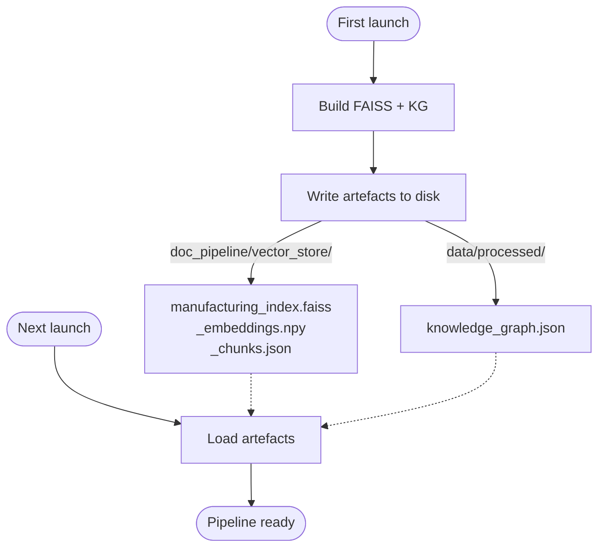

---

## Unified Component Architecture

```mermaid
flowchart TB
    subgraph CFG["config.py (root)"]
        OPT["INPUT_DOCS_DIR, VECTOR_STORE_DIR<br/>EMBEDDING_MODEL, ANSWER_MODEL,<br/>CRITIC_MODEL, RETRY_MODEL,<br/>OLLAMA_BASE_URL, TOP_K_*, RRF_K,<br/>MAX_CRITIC_RETRIES, DOMAIN_ONTOLOGY"]
    end

    subgraph DOCP["doc_pipeline/"]
        DI["document_ingestion.py<br/>PDFParser · TXTParser · ExcelParser<br/>DocType enum"]
        CH["chunking.py<br/>SemanticChunker · RecursiveChunker<br/>SlidingWindowChunker · HybridChunker"]
        EMB["embeddings.py<br/>EmbeddingPipeline (FAISS)"]
        CA["clarifier_agent.py<br/>IntentClassifier · EntityExtractor<br/>SlotFiller · ClarifierAgent"]
        QC["query_correction.py<br/>QueryCorrector (spell + acronym + synonym)"]
        RE["rag_engine.py<br/>RAGEngine + QueryResponse<br/>(standalone façade)"]
        CSD["create_sample_docs.py<br/>+ input_docs/ (7 demo files)"]
    end

    subgraph PIPE["pipeline/ (NEW — unification layer)"]
        ADP["adapter.py<br/>chunks_to_core_docs()<br/>extracts equipment_ids,<br/>alarm_codes, part_numbers,<br/>fault_codes from text"]
        FVR["faiss_retriever.py<br/>FaissVectorRetriever<br/>(API-compatible with core)"]
        UP["unified_pipeline.py<br/>ManufacturingPipeline<br/>build_or_load() + 4 query modes"]
    end

    subgraph CORE["core/"]
        KG["knowledge_graph.py<br/>build · query · persist (JSON)"]
        QFMT["query_formatter.py<br/>intent + entity + abbreviations"]
        ORC["orchestrator.py<br/>process_query() w/ injected retriever"]
        CRT["critic.py<br/>critic_evaluate()"]
        LLMC["llm_client.py<br/>OpenAI + Ollama tiered routing"]
    end

    subgraph RETSUB["core/retrieval/"]
        BMR["bm25_retriever.py<br/>BM25Okapi (rank_bm25 OR fallback)"]
        VR["vector_retriever.py<br/>(ChromaDB — optional)"]
        GR["graph_retriever.py<br/>entity-based scoring"]
        HRY["hybrid_retriever.py<br/>RRF + edge priors<br/>(accepts injected vector retriever)"]
    end

    subgraph CMP["comparison/"]
        DL["direct_llm.py"]
        CR["classical_rag.py<br/>(uses injected retriever)"]
        BN["benchmark.py<br/>SAMPLE_QUERIES + runner"]
    end

    subgraph U["utils/"]
        MT["metrics.py<br/>format_*  ·  compute_cost_projection"]
    end

    APP["app.py (Streamlit)<br/>5 tabs"]
    CLI2["main.py (CLI)<br/>--query / --diagnostic / --compare"]
    DOCAPP["doc_pipeline/app.py<br/>(legacy, doc_pipeline-only)"]

    APP --> UP
    CLI2 --> UP

    UP --> DI
    UP --> CH
    UP --> EMB
    UP --> CA
    UP --> QC
    UP --> ADP
    UP --> FVR
    UP --> KG
    UP --> ORC
    UP --> CR
    UP --> DL

    ADP --> KG
    FVR --> EMB
    HRY --> BMR
    HRY --> FVR
    HRY --> VR
    HRY --> GR
    GR --> KG

    ORC --> QFMT
    ORC --> HRY
    ORC --> CRT
    ORC --> LLMC
    CR --> FVR
    CR --> LLMC
    DL --> LLMC

    DOCAPP --> RE
    RE --> DI
    RE --> CH
    RE --> EMB
    RE --> CA
    RE --> QC

    CFG -.consumed by.-> DOCP
    CFG -.consumed by.-> PIPE
    CFG -.consumed by.-> CORE
    CFG -.consumed by.-> RETSUB
    CFG -.consumed by.-> CMP
    APP --> MT
```

Highlights of the new layer:

- **`pipeline.adapter.chunks_to_core_docs`** is the bridge. It takes `doc_pipeline.chunking.Chunk`
  objects (the output of the smart chunker) and emits the `{chunk_id, text, metadata}` dicts the
  core retrievers and KG builder expect. Along the way it auto-extracts entity references
  (`equipment_ids`, `alarm_codes`, `part_numbers`, `fault_codes`) directly from the chunk text so
  the KG nodes/edges materialise without re-parsing.
- **`pipeline.faiss_retriever.FaissVectorRetriever`** is a drop-in replacement for the ChromaDB
  retriever; it reuses the embedding pipeline so the FAISS index is built **once** and shared by
  the orchestrator and the Classical RAG baseline.
- **`pipeline.unified_pipeline.ManufacturingPipeline`** wires everything in `build_or_load()`:
  ingest → chunk → embed (FAISS) → adapter → KG → BM25 → orchestrator/critic. Subsequent runs
  load the FAISS index and KG from disk and skip the heavy work.

---

## End-to-End Activity Flow

```mermaid
flowchart TD
    A([User launches app.py / main.py]) --> B{FAISS index<br/>on disk?}
    B -- Yes --> L1[Load FAISS index + chunks]
    B -- No  --> P1[Parse PDFs / TXT / Excel] --> P2[HybridChunker]
    P2 --> P3[Encode + build FAISS index] --> P4[Persist index]
    L1 --> ADP[Adapter: chunks → core dicts<br/>+ extract entities]
    P4 --> ADP
    ADP --> KG{KG file<br/>on disk?}
    KG -- Yes --> KL[Load knowledge_graph.json]
    KG -- No  --> KB[Build NetworkX graph<br/>from chunk metadata]
    KL --> BM[Build BM25 (in-memory)]
    KB --> BM
    BM --> RDY([Pipeline ready])

    RDY --> Q[User submits query]
    Q --> CLAR[ClarifierAgent<br/>intent + entities + slots]
    Q --> CORR[QueryCorrector<br/>spell + acronym + synonyms]
    CLAR & CORR --> MODE{Mode?}

    MODE -- Quick Search --> FQ[FAISS search<br/>+ context window]
    FQ --> REND1([Render results + clarifier panel])

    MODE -- Diagnostic --> OQ[Orchestrator.process_query]
    OQ --> ALLOW[KG allow-list<br/>1-hop + 2-hop chunks]
    ALLOW --> PAR{{Parallel retrieval}}
    PAR --> B1[BM25 top-10] & V1[FAISS top-10] & G1[Graph top-10]
    B1 & V1 & G1 --> RRF[Reciprocal Rank Fusion]
    RRF --> EP[Edge-prior boost]
    EP --> EV[Top-5 evidence]
    EV --> LLM[LLM answer (ANSWER_MODEL)]
    LLM --> CRT[Critic (CRITIC_MODEL)]
    CRT -- PASS --> REND2([Answer + citations + KG view + metrics])
    CRT -- FAIL & retries left --> RETRY[Retry LLM (RETRY_MODEL)<br/>with critic feedback] --> CRT
    CRT -- FAIL & exhausted --> REND2

    MODE -- Classical RAG --> CRP[FAISS top-5 → LLM] --> REND2
    MODE -- Direct LLM    --> DLP[LLM only, no retrieval] --> REND2
```

---

## Pipeline Sequence Diagram

The Diagnostic Copilot mode end-to-end:

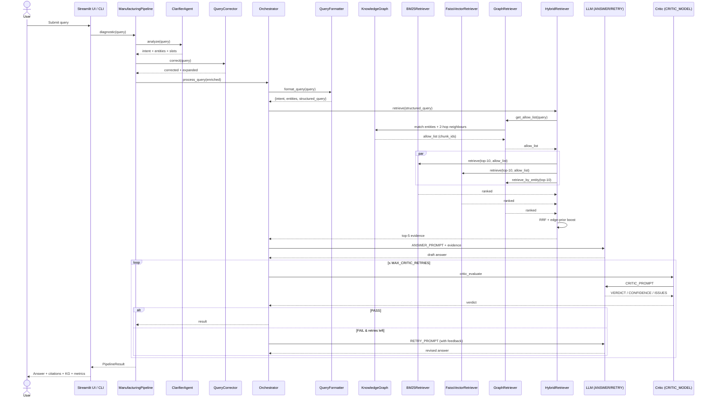

---

## Knowledge Graph Schema

The KG ontology is defined in `config.py → DOMAIN_ONTOLOGY` and built by
`core/knowledge_graph.py` from chunk metadata produced by `pipeline/adapter.py`.

### Entity Types

`Equipment`, `Component`, `Alarm`, `FailureMode`, `Symptom`, `Cause`, `Procedure`,
`SparePart`, `Specification`

### Relation Types

`HAS_COMPONENT`, `TRIGGERS_ALARM`, `CAUSES_FAILURE`, `HAS_SYMPTOM`, `RESOLVED_BY`,
`REQUIRES_PART`, `FOLLOWS_PROCEDURE`, `HAS_SPECIFICATION`

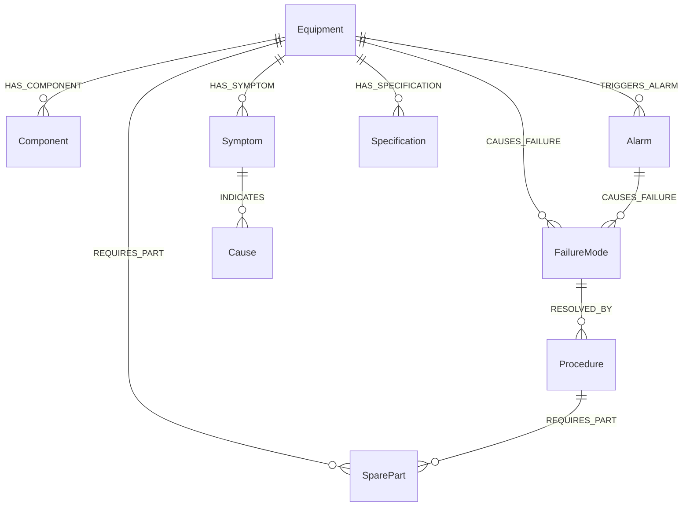

### Traversal Routes

| Route                 | Path                                                |
| --------------------- | --------------------------------------------------- |
| `symptom_to_fix`      | `Symptom → Cause → FailureMode → Procedure`         |
| `alarm_to_procedure`  | `Alarm → Equipment → FailureMode → Procedure`       |
| `equipment_to_parts`  | `Equipment → Component → SparePart`                 |

### ID Patterns Recognised in Text

The adapter and KG entity matcher now recognise both the legacy and the doc_pipeline schemas:

| Type          | Regex                                                                                                                | Example                |
| ------------- | -------------------------------------------------------------------------------------------------------------------- | ---------------------- |
| Equipment     | `P-\d{3}`, `CV-\d{3}`, `HP-\d{3}`, `CNC-[A-Z]-\d{3}`, `STAMP-[A-Z]-\d{3}`, `WELD-[A-Z]-\d{3}`, `HT-[A-Z]-\d{3}`, `COAT-[A-Z]-\d{3}` | `P-203`, `CNC-A-004`   |
| Alarm         | `ALM-[A-Z]\d{3}`                                                                                                     | `ALM-P001`             |
| Part / spare  | `SP-\d{4}`, `TH-\d{4}`, `BRK-\d{4}`, `SFT-\d{4}`, `HSG-\d{4}`, `GR-\d{4}`                                            | `SP-1042`, `TH-4401`   |
| Fault code    | `FC-\d{3}`                                                                                                           | `FC-003`               |
| Work order    | `WO-\d{4}-\d{3}`                                                                                                     | `WO-2024-117`          |

---

## Retrieval Fusion Internals

```mermaid
flowchart LR
    Q[Structured Query] --> AL[Graph Allow-List<br/>1-hop + 2-hop chunk_ids]

    AL --> B[BM25Retriever<br/>top-10]
    AL --> V[FaissVectorRetriever<br/>top-10]
    Q  --> G[GraphRetriever<br/>entity score top-10]

    B --> RRF["RRF score =<br/>Σ 1 / (RRF_K + rank + 1)"]
    V --> RRF
    G --> RRF

    RRF --> EP[Edge-Prior Boost<br/>+= prior × 0.1]
    EP --> SORT[Sort by rrf_score desc]
    SORT --> TOP[Top-K rerank<br/>(TOP_K_RERANK=5)]
    TOP --> EVID[Final Evidence Chunks<br/>with text + metadata]
```

**Reciprocal Rank Fusion** (see `core/retrieval/hybrid_retriever.py`):

```
rrf_score(c) = Σ over retrievers   1 / (RRF_K + rank(c, retriever) + 1)
```

After fusion each chunk receives an additive boost proportional to the average prior of graph edges
touching that chunk — encoding _"this relationship has been seen many times in the corpus, so trust
it more"_.

---

## Clarifier Agent & Query Correction

Two new front-end layers sit between the user's raw query and the retriever stack:

### `doc_pipeline/clarifier_agent.py`

```mermaid
flowchart LR
    Q[Raw query] --> IC[IntentClassifier<br/>regex patterns + scores]
    Q --> EE[EntityExtractor<br/>equipment, parts, suppliers,<br/>metrics, plants, standards,<br/>dates, materials, severities]
    IC --> SF[SlotFiller<br/>intent-specific templates]
    EE --> SF
    SF --> R[ClarifierResult<br/>+ enriched_query<br/>+ clarification_prompt<br/>(if required slots missing)]
```

**Intents:** `lookup`, `comparison`, `troubleshooting`, `compliance`, `metric_query`, `procedure`,
`trend`, `status`, `root_cause`, `unknown`.

When required slots are missing the agent emits a deterministic clarification prompt (e.g.
_"Which metric would you like? (e.g., OEE, MTBF, scrap rate, CPK, PPM)"_), which the UI surfaces as
a warning banner so the user can refine the query.

### `doc_pipeline/query_correction.py`

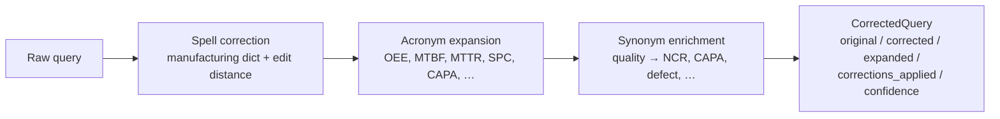

The unified pipeline feeds the **enriched** query (entities annotated) to the retrievers, and
preserves the corrections list so the UI can show the user what changed.

> **Safety guard:** the spell corrector protects common English verbs/nouns used in troubleshooting
> queries (`fail`, `break`, `stop`, `alarm`, `leak`, `jam`, …) and never substitutes a longer word
> with a target shorter than 5 characters. This prevents misfires like `fail` → `FAI` (First Article
> Inspection).

---

## Conversational Chat & Deployment

The unified pipeline is fronted by three interchangeable surfaces, all driven by the same
**`ChatAgent`** (in `pipeline/chat_agent.py`):

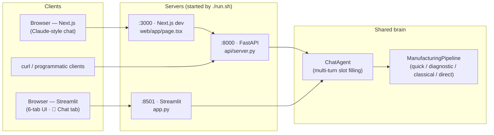

### ChatAgent — multi-turn slot filling

`pipeline/chat_agent.py` wraps `ClarifierAgent` + `QueryCorrector` + `ManufacturingPipeline` with a
small state machine per session:

1. **Auto-correct.** Every user turn passes through `QueryCorrector`. Spelling fixes are surfaced as
   an inline 🪄 _"I read that as…"_ note above the answer. Acronym expansions and synonym
   enrichments stay in-band for retrieval but are not noisily shown to the user.
2. **Analyse.** `ClarifierAgent.analyze()` extracts intent, entities, and required/optional slots.
3. **Ask follow-ups.** If a **required** slot is missing the agent posts an `❓` clarifying question
   (e.g. _"Which equipment or line? (e.g., CNC-A-004, CNC Line 4, Stamping Press #1)"_) and waits
   for the next user turn. Replies are concatenated into an accumulated query and re-analysed.
4. **One optional polish.** After all required slots are filled, the agent asks at most **one**
   high-value optional slot (priority: `time_period` → `equipment` → `plant` → `department`).
5. **Skip.** Replies of `skip`, `n/a`, `none`, `pass`, `-`, `idk`, … proceed without that slot.
6. **Reset.** `/reset`, `/new`, `/clear`, or the **New chat** button clear the conversation.
7. **Route.** When ready, the agent calls `pipe.diagnostic()` (LLM + critic) if `OPENAI_API_KEY`
   is configured, otherwise `pipe.quick_search()` and synthesises a top-evidence summary.

Each turn keeps full metadata: intent, entities, latency, tokens, cost, critic verdict, evidence
chunks, and matched KG nodes — surfaced as chips and collapsible panels in both UIs.

### FastAPI backend (`api/server.py`)

| Method | Path                  | Purpose                                                |
| ------ | --------------------- | ------------------------------------------------------ |
| GET    | `/api/health`         | Liveness + LLM availability + pipeline-ready flag      |
| GET    | `/api/stats`          | Document, vector, KG node/edge counts                  |
| POST   | `/api/chat`           | `{session_id, message}` → updated transcript + state   |
| POST   | `/api/reset`          | Clear a session's conversation                         |
| GET    | `/api/sessions/{id}`  | Fetch the current transcript for a session             |
| GET    | `/docs`               | OpenAPI / Swagger UI                                   |

Sessions are kept in memory keyed by client-supplied `session_id` (the Next.js UI stores a UUID in
`localStorage`). CORS is wide open for local development. All dataclasses (`Slot`,
`ClarifierResult`, `PipelineResult`) are flattened to JSON-safe payloads in `api/serializers.py`.

### Next.js Claude-style web UI (`web/`)

```
web/
├── app/
│   ├── layout.tsx          # cream background, Inter font
│   ├── page.tsx            # main chat page (session, polling, optimistic UI)
│   └── globals.css         # Claude-style typography + markdown styles
├── components/
│   ├── ChatMessage.tsx     # bubble + chips + evidence + graph panels
│   ├── ChatComposer.tsx    # auto-growing textarea + send button
│   └── Sidebar.tsx         # status, suggestions, stats
├── lib/api.ts              # typed FastAPI client
├── next.config.js          # /api/* rewrite → http://localhost:8000
├── tailwind.config.ts      # cream + copper palette
└── package.json            # Next 14 · React 18 · Tailwind 3
```

Highlights:

- **Visual style** — warm cream background (`#fbfaf7`), copper accent (`#c25b3f`), serif headings,
  pill-shaped suggestion chips, soft shadows.
- **Per-bubble metadata** — intent badge, entity chips, latency, tokens, cost, critic verdict.
- **Expandable panels** — 📎 evidence (source, page, sheet, score, snippet) and 🔗 knowledge graph
  (node IDs + types) inline under the answer.
- **Session memory** — `mfg-graphrag-session-id` stored in `localStorage` so refreshes keep history.
- **Backend rewrite** — Next dev server proxies `/api/*` to `NEXT_PUBLIC_API_ORIGIN`
  (default `http://localhost:8000`), so the frontend has no CORS or hard-coded URLs.

### One-command stack: `run.sh` / `stop.sh` / `status.sh`

```bash
./run.sh        # boot api + streamlit + web in the background
./status.sh     # 3-line health summary
./stop.sh       # graceful TERM → KILL by PID, with port-based fallback sweep
```

What `run.sh` does:

1. Picks `/opt/anaconda3/bin/python` if present, else `python3` (override via `PYTHON_BIN=`).
2. Frees ports 8000 / 8501 / 3000 if any zombie listeners are present.
3. Starts **`uvicorn api.server:app`** on `:8000`, waits for `/api/health` to return 200.
4. Starts **`streamlit run app.py`** on `:8501`, waits for `/_stcore/health`.
5. Runs **`npm install`** in `web/` on first invocation, then starts **`next dev`** on `:3000`.
6. Writes PIDs to `.run/{api,streamlit,web}.pid` and logs to `.run/logs/<service>.log`.

Useful overrides:

```bash
API_PORT=8001 STREAMLIT_PORT=8502 WEB_PORT=3001 ./run.sh
SKIP_WEB=1 ./run.sh                       # API + Streamlit only
SKIP_STREAMLIT=1 ./run.sh                 # API + Next.js only
PYTHON_BIN=/path/to/venv/bin/python ./run.sh
tail -f .run/logs/api.log                 # follow a service log
```

---

## Critic Loop State Machine

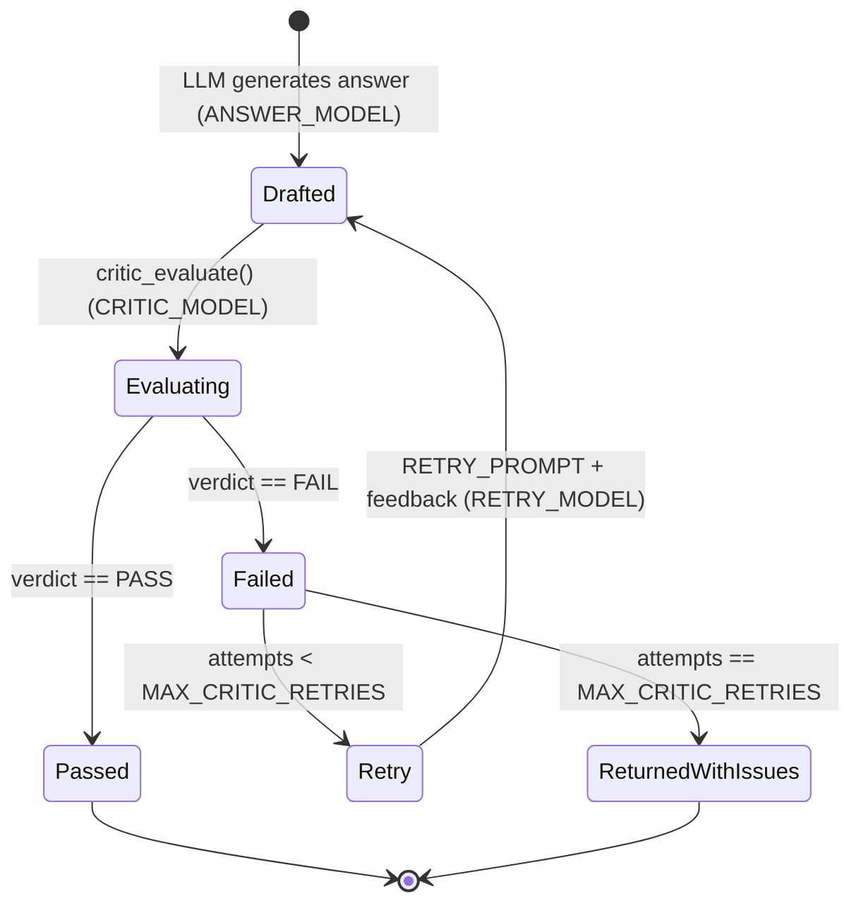

The critic checks 5 dimensions:

1. **Factual Grounding** — every claim traceable to a chunk
2. **Completeness** — does it address the question?
3. **Technical Accuracy** — IDs/codes match source
4. **Actionability** — concrete next steps for troubleshooting
5. **Safety** — proper warnings on safety-critical procedures

Output schema:

```
VERDICT: PASS | FAIL
CONFIDENCE: 0.0 – 1.0
ISSUES: <list or "None">
SUGGESTION: <how to fix on retry>
```

### LangGraph orchestration (opt-in)

The same critic loop is also available as an explicit **LangGraph `StateGraph`**
in `pipeline/langgraph_orchestrator.py`. Set `USE_LANGGRAPH=true` in `.env`
and `ManufacturingPipeline` will route every diagnostic query through the
graph below instead of the procedural `core.orchestrator.Orchestrator`. The
response shape is identical (the only visible difference is
`response["pipeline"] == "hybrid_graphrag_langgraph"`), so the Streamlit /
Next.js / FastAPI layers don't need any changes.

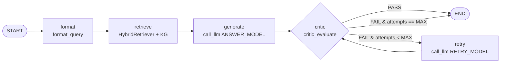

| Node       | What it does                                                            | Calls                                  |
| ---------- | ----------------------------------------------------------------------- | -------------------------------------- |
| `format`   | Intent + entity extraction, query expansion                             | `core.query_formatter.format_query`    |
| `retrieve` | Hybrid BM25 + FAISS + KG retrieval and allow-list                       | `HybridRetriever.retrieve` + `KnowledgeGraph` |
| `generate` | First-draft answer                                                      | `call_llm_with_metrics(ANSWER_MODEL)`  |
| `critic`   | Grounding / completeness / safety check; increments `attempt_idx`       | `critic_evaluate(CRITIC_MODEL)`        |
| `retry`    | Regenerate using the critic's feedback                                  | `call_llm_with_metrics(RETRY_MODEL)`   |

**Why LangGraph instead of the procedural loop?**

- Explicit, inspectable state (`GraphState` TypedDict) per turn — easier to debug or
  visualise (e.g. plug into LangSmith for traces).
- Single place to add new nodes — _planner_, _self-RAG re-retrieval_,
  _human-in-the-loop approval_, etc. — without rewriting the control flow.
- Ecosystem fit: any future LangChain tool/agent can be dropped in as a node.

**Why opt-in?**

- The procedural orchestrator has zero non-stdlib graph deps and is the
  battle-tested default.
- Without `langgraph` installed (or with `USE_LANGGRAPH=false`), the pipeline
  falls back automatically and logs `Diagnostic engine: procedural Orchestrator`.
- With `USE_LANGGRAPH=true` and `langgraph` installed, you'll see
  `Diagnostic engine: LangGraph (USE_LANGGRAPH=true)` at startup and
  `pipe.stats["orchestrator_engine"] == "langgraph"` at runtime.

**Enable it:**

```bash
echo "USE_LANGGRAPH=true" >> .env
./run.sh        # langgraph + langchain-core are installed by run.sh automatically
```

### Cause-ranking LLM stage (optional)

For troubleshooting / failure-analysis queries you can insert a **dedicated
cause-ranking LLM** between retrieval and answer generation. The stage is
implemented in `core/cause_ranker.py` and is integrated into both the
procedural orchestrator and the LangGraph orchestrator — enabling it just
requires:

```bash
echo "USE_CAUSE_RANKING=true"   >> .env
echo "CAUSE_RANK_MODEL=qwen2.5:3b" >> .env   # default: free local Ollama model
echo "CAUSE_RANK_TOP_K=5"          >> .env   # default: top 5 causes
```

#### What it does

1. After the hybrid retriever returns the top-k chunks and the KG returns the
   query subgraph, the ranker collects:
   * KG nodes typed `Cause` / `FailureMode` from that subgraph, and
   * The retrieved evidence chunks (truncated to keep prompt size bounded).
2. It calls `CAUSE_RANK_MODEL` (default `qwen2.5:3b` on Ollama — free) with a
   strict-JSON prompt asking for a ranked list of root causes, each with a
   `score`, `rationale`, and the `evidence_chunk_ids` it relies on.
3. The parsed candidates are formatted into a `LIKELY ROOT CAUSES …` block
   that is **prepended to the answer LLM's prompt** so the final
   "Root Cause candidates" section in the diagnostic answer is anchored on
   explicitly scored, citation-tagged candidates rather than implicit ranking.

#### Intent gating

The stage is *intent-gated*: it short-circuits to an empty result for any
query whose intent doesn't match troubleshooting / failure-analysis triggers
(`troubleshoot`, `diagnos`, `root_cause`, `failure`, `fault`, `repair`,
`fix`, `incident`, `broken`, `alarm`). So the cost is paid only on queries
that actually need it — a "what's the spec for bolt M8?" query will skip the
node entirely and the prompt enrichment step.

#### Where it appears in the LangGraph topology

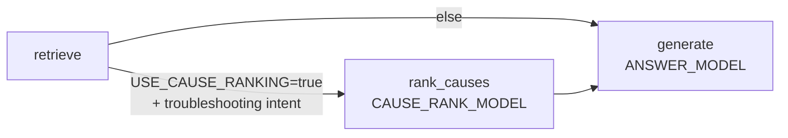

The procedural orchestrator follows the same logic via the same
`rank_causes()` function, so behaviour is identical regardless of the
`USE_LANGGRAPH` setting.

#### Response shape

When the stage runs, the response gains a `cause_ranking` field alongside
the existing `evidence` / `critic` blocks:

```json
{
  "answer": "…",
  "cause_ranking": {
    "candidates": [
      { "cause": "Bearing wear", "score": 0.85, "rationale": "...",
        "evidence_chunk_ids": ["pump_manual.pdf:c12"] },
      { "cause": "Coupling misalignment", "score": 0.42, "rationale": "...",
        "evidence_chunk_ids": ["maint_log.xlsx:c5"] }
    ],
    "model": "qwen2.5:3b",
    "total_tokens": 280,
    "cost_estimate": 0.0
  },
  "metrics": { "cause_ranking_ms": 187.4, "..." }
}
```

When the stage is skipped, `cause_ranking` is either `null` or contains a
`"skipped"` reason (`"intent_not_troubleshooting"` / `"no_evidence"`) along
with zero token usage.

---

## Models & LLM Routing

The system uses **five purpose-tuned models** instead of one generalist. Strong cloud models do
the user-facing reasoning; cheap local models handle auxiliary work (intent / critic / classifier)
so token spend stays on the critical path.

### Models in active use (default configuration)

| Role / env var          | Model                | Provider                 | Where it runs in code                                  | Notes |
| ----------------------- | -------------------- | ------------------------ | ------------------------------------------------------ | ----- |
| `ANSWER_MODEL`          | `gpt-4o`             | **OpenAI** (cloud)       | `core/orchestrator.py` — first-pass diagnostic answer  | Strong reasoning + citations |
| `RETRY_MODEL`           | `gpt-4o`             | **OpenAI** (cloud)       | `core/orchestrator.py` — regenerate after critic FAIL  | Used at most `MAX_CRITIC_RETRIES` times |
| `CRITIC_MODEL`          | `qwen2.5:3b`         | **Ollama** (local)       | `core/critic.py` — grades grounding / safety / citations | Free, ~50ms per evaluation |
| `CAUSE_RANK_MODEL`      | `qwen2.5:3b`         | **Ollama** (local)       | `core/cause_ranker.py` — ranks root-cause candidates    | Optional; enable with `USE_CAUSE_RANKING=true`. Intent-gated to troubleshooting queries. See [Cause-Ranking LLM stage](#cause-ranking-llm-stage-optional). |
| `CLASSIFY_MODEL`        | `qwen2.5:3b`         | **Ollama** (local)       | LLM-assisted intent classification (fallback path)     | Regex classifier handles most queries first |
| `DIRECT_LLM_MODEL`      | `gpt-4o-mini`        | **OpenAI** (cloud)       | `comparison/direct_llm.py` — no-retrieval baseline     | For Comparison tab only |
| `CLASSICAL_RAG_MODEL`   | `gpt-4o-mini`        | **OpenAI** (cloud)       | `comparison/classical_rag.py` — FAISS-only baseline    | For Comparison tab only |
| `LLM_MODEL` _(legacy)_  | `gpt-4o-mini`        | **OpenAI** (cloud)       | Legacy fallback when tiered routing is bypassed        | Rarely hit on new code paths |
| `EMBEDDING_MODEL`       | `all-MiniLM-L6-v2`   | **Sentence-Transformers** (local) | `doc_pipeline/embeddings.py` + `chunking.py`     | 384-dim, used for both indexing and semantic chunking |

All values come from `config.py` defaults and can be overridden in `.env`.

### Per-mode model usage

| Mode                  | Models invoked per query                                                                 |
| --------------------- | ---------------------------------------------------------------------------------------- |
| **Quick Search**      | **none** — pure FAISS + embeddings, fully offline                                        |
| **Diagnostic Copilot**| optional `qwen2.5:3b` (cause-ranker) → `gpt-4o` (answer) → `qwen2.5:3b` (critic) → optional `gpt-4o` (retry, up to `MAX_CRITIC_RETRIES`) |
| **Chat (default)**    | Same as Diagnostic, with `qwen2.5:3b` optionally classifying intent ahead of retrieval   |
| **Classical RAG**     | `gpt-4o-mini`                                                                            |
| **Direct LLM**        | `gpt-4o-mini`                                                                            |

The headline cost saving is the critic loop: every diagnostic answer is **graded by a free local
model** before it leaves the server. OpenAI tokens are only spent on draft + (occasional) retry.

### Provider routing

Both providers are served through the OpenAI SDK by exploiting Ollama's OpenAI-compatible HTTP
endpoint:

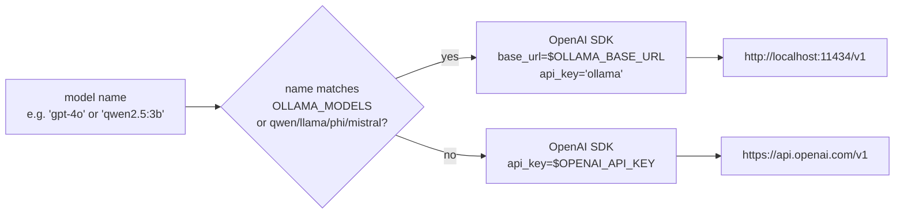

```4:37:core/llm_client.py
from openai import OpenAI

from config import OPENAI_API_KEY, LLM_MODEL, OLLAMA_BASE_URL

_openai_client = None
_ollama_client = None

OLLAMA_MODELS = {"qwen2.5:3b", "qwen2.5:1.5b", "qwen2.5:7b", "llama3.2:3b", "phi3:3.8b", "mistral:7b"}

# ... pricing table omitted ...

def _is_local_model(model: str) -> bool:
    return model in OLLAMA_MODELS or model.startswith(("qwen", "llama", "phi", "mistral:"))


def _get_openai_client():
    global _openai_client
    if _openai_client is None:
        _openai_client = OpenAI(api_key=OPENAI_API_KEY)
    return _openai_client


def _get_ollama_client():
    global _ollama_client
    if _ollama_client is None:
        _ollama_client = OpenAI(base_url=OLLAMA_BASE_URL, api_key="ollama")
    return _ollama_client
```

### Switching models

Everything is `.env`-driven. Some practical swaps:

```bash
# 100% OpenAI (no Ollama dependency)
CRITIC_MODEL=gpt-4o-mini
CLASSIFY_MODEL=gpt-4o-mini

# 100% local (no OpenAI charges; Ollama-only)
ANSWER_MODEL=qwen2.5:7b
RETRY_MODEL=qwen2.5:7b
DIRECT_LLM_MODEL=qwen2.5:3b
CLASSICAL_RAG_MODEL=qwen2.5:3b
# (leave OPENAI_API_KEY blank — Quick Search and Chat still work as retrieval-only)

# Use a different embedding model — must rebuild the FAISS index after changing this
EMBEDDING_MODEL=BAAI/bge-small-en-v1.5
```

The `OLLAMA_MODELS` set in `core/llm_client.py` plus the `qwen/llama/phi/mistral:` name-prefix
heuristic decide which provider handles a given model name. Any model name that doesn't match the
local list (`qwen2.5:*`, `llama3.2:*`, `phi3:*`, `mistral:*`) is sent to OpenAI.

### Setup checklist

- **OpenAI** — set `OPENAI_API_KEY` in `.env`. Without it, Diagnostic / Chat-with-LLM / Comparison
  modes fall back to retrieval-only.
- **Ollama** — install [Ollama](https://ollama.com), then:
  ```bash
  ollama pull qwen2.5:3b      # the default critic + classifier
  ollama serve                # listens on :11434
  ```
  Without Ollama, set `CRITIC_MODEL=gpt-4o-mini` (or any OpenAI model) so the critic loop falls
  back to the cloud.

### Cost & latency profile

The numbers below assume **5 evidence chunks @ ~300 tokens** (`TOP_K_RERANK=5`) and the default
tiered routing (answer = `gpt-4o`, critic = `qwen2.5:3b` on Ollama, all baselines on
`gpt-4o-mini`). OpenAI per-1k pricing is sourced from `MODEL_PRICING` in `core/llm_client.py`;
Ollama-served models are free.

> **Tip:** The same tables (with the LangGraph topology and a per-node reference) are baked
> into [`system_design/system_architecture.pdf`](system_design/system_architecture.pdf) — a
> 7-page design document you can hand to new engineers. Regenerate with
> `python system_design/generate_diagram.py`.

#### Per-mode summary (typical query)

| Mode                              | LLM calls per query             | Tokens (in / out)                   | Cost / query | Latency p50  | Notes |
| --------------------------------- | ------------------------------- | ----------------------------------- | -----------: | -----------: | ----- |
| Quick Search                      | 0                               | 0 / 0                               | **$0.0000**  | 120–400 ms   | FAISS + embeddings only; works fully offline |
| **Diagnostic (default)**          | 1 answer + 1 critic             | ~1500 / ~400  +  ~700 / ~150        | **~$0.0080** | 2.0–4.5 s    | Answer on `gpt-4o`, critic on `qwen2.5:3b` (free) |
| Diagnostic + cause-ranker         | + 1 cause-ranker                | + ~1200 / ~250                      | **+ $0.0000**| + 100–500 ms | `USE_CAUSE_RANKING=true`; intent-gated |
| Diagnostic worst-case             | 1 answer + 2 critics + 1 retry  | ~3700 / ~950                        | **~$0.0160** | 4.5–9 s      | Critic FAILs once, retry resolves |
| Chat (multi-turn)                 | Same as Diagnostic              | Same as Diagnostic                  | Same         | Same         | Plus per-turn slot-filling (no LLM) |
| Classical RAG (baseline)          | 1                               | ~1500 / ~400                        | **~$0.0005** | 1.0–2.0 s    | FAISS-only retrieval, `gpt-4o-mini` answer |
| Direct LLM (baseline)             | 1                               | ~150 / ~400                         | **~$0.0003** | 0.8–1.5 s    | No retrieval; `gpt-4o-mini` parametric only |

#### Per-stage detail (Diagnostic mode, `USE_CAUSE_RANKING=true`, 1 retry path)

| Stage             | Model               | Provider          | Tokens (in / out) | Cost / call  | Latency p50  | Mandatory? |
| ----------------- | ------------------- | ----------------- | ----------------- | -----------: | -----------: | ---------- |
| `format`          | regex → `qwen2.5:3b`| Ollama (fallback) | 0–250 / 0–80      | **$0.0000**  | 5–60 ms      | yes |
| `retrieve`        | —                   | FAISS + BM25 + KG | 0 / 0             | **$0.0000**  | 50–300 ms    | yes |
| `rank_causes`     | `qwen2.5:3b`        | Ollama            | ~1200 / ~250      | **$0.0000**  | 100–500 ms   | `USE_CAUSE_RANKING` + troubleshooting intent |
| `generate`        | `gpt-4o`            | OpenAI            | ~1500 / ~400      | **~$0.0050** | 1.5–3 s      | yes |
| `critic` (1st)    | `qwen2.5:3b`        | Ollama            | ~700 / ~150       | **$0.0000**  | 50–250 ms    | yes |
| `retry` (if FAIL) | `gpt-4o`            | OpenAI            | ~1700 / ~400      | **~$0.0050** | 1.5–3 s      | FAIL & `attempts<MAX_CRITIC_RETRIES` |
| `critic` (2nd)    | `qwen2.5:3b`        | Ollama            | ~700 / ~150       | **$0.0000**  | 50–250 ms    | after retry |

#### Cloud-vs-local pricing (per 1k tokens, from `core/llm_client.py`)

| Model role                       | Default            | OpenAI in / out      | Local equivalent       | Switch via `.env`                                                  | Net effect |
| -------------------------------- | ------------------ | -------------------- | ---------------------- | ------------------------------------------------------------------ | ---------- |
| Answer / Retry                   | `gpt-4o`           | $0.0025 / $0.010     | `qwen2.5:7b` on Ollama | `ANSWER_MODEL=qwen2.5:7b`                                          | 100% free, slower latency |
| Critic                           | `qwen2.5:3b`       | n/a (local)          | —                      | `CRITIC_MODEL=gpt-4o-mini`                                         | $0 → ~$0.0001 / call |
| Cause-ranker (opt-in)            | `qwen2.5:3b`       | n/a (local)          | —                      | `CAUSE_RANK_MODEL=gpt-4o-mini`                                     | $0 → ~$0.0002 / call |
| Comparison (Direct / Classical)  | `gpt-4o-mini`      | $0.00015 / $0.0006   | `qwen2.5:3b` on Ollama | `DIRECT_LLM_MODEL=…` / `CLASSICAL_RAG_MODEL=…`                     | Free at slight quality cost |
| Embeddings                       | `MiniLM-L6-v2`     | n/a (local)          | —                      | `EMBEDDING_MODEL=BAAI/bge-small-en-v1.5`                           | Rebuild FAISS after change |

#### Headline economics

- **Critic loop is free**: every diagnostic answer is graded by a local Qwen-3B model before
  it leaves the server. Cloud tokens are spent only on draft + (occasional) retry.
- **Cause-ranking is free**: the optional cause-ranker also runs on Ollama by default, adds
  100–500 ms of latency, and is intent-gated so non-troubleshooting queries skip it entirely.
- **A typical Diagnostic query costs ~$0.008**; a worst-case (1 retry) is ~$0.016. The Streamlit
  **🔄 Architecture & Cost** tab projects daily / monthly spend live from these numbers.

The exact figures depend on prompt length, model temperature, network conditions, and how often
the critic forces a retry. Streamlit displays the actual per-query metrics returned by the
orchestrator (`response["metrics"]`) for every chat turn.

---

## Human-in-the-Loop (HITL) Approval Gate

Production deployments need a way to **automate the easy decisions and escalate the dangerous
ones**. The HITL layer adds two LangGraph nodes (`criticality_check` + `human_approval`) plus a
durable checkpointer so the orchestrator can pause at a `langgraph.types.interrupt(...)`, surface
the proposal in the Streamlit `📋 Approvals` tab (or via `/api/approvals/*`), and then resume on
either side of an `Approve` / `Reject` / `Edit & approve` decision.

The full PRD lives in [`system_design/HITL_DESIGN.md`](system_design/HITL_DESIGN.md). This
section is the operator's quick-start.

### Topology change

```
START → format → detect_purchase → retrieve → [rank_causes] → generate → criticality_check
                                                                                 │
                                                                ┌────────────────┴──────────────────┐
                                                                ▼                                   ▼
                                                       human_approval (interrupt)               critic
                                                                │                                   │
                                                ┌───approved────┴───rejected───┐         PASS / max retries
                                                ▼                              ▼                    │
                                              critic                          END                  END
                                                │
                                            PASS / max
                                                ▼
                                              END
```

* **`detect_purchase`** parses the user query for purchase-request intent (Phase C). When intent
  matches, the parsed `PurchaseRequest` is enriched from the KG (`Equipment ─REQUIRES_PART→
  SparePart ─SUPPLIED_BY→ Vendor`) and stashed in the graph state.
* **`criticality_check`** combines deterministic rules (safety keywords, dollar threshold, low
  critic confidence, high-risk intents like `lockout_tagout` / `shutdown` / `emergency`) with an
  optional tier-2 LLM grader for the inconclusive band. Returns a `Risk(score, drivers, …)`
  whose `needs_human` flag drives the next routing.
* **`human_approval`** calls `interrupt({...})`. The graph state is checkpointed to either an
  in-memory store or a SQLite file (`HITL_CHECKPOINT_BACKEND=sqlite|memory`). The interrupted
  thread is exposed via `pipe.pending_approvals()` and `/api/approvals/pending`.
* On resume (`graph.invoke(Command(resume=decision), config={"configurable": {"thread_id": …}})`)
  the decision flows back into the node, optionally overwrites the answer with `edited_answer`,
  and either short-circuits to `END` (rejected) or continues into `critic` (approved).

### Use cases (covered today)

| # | Workflow | Auto-approve when … | Escalates when … |
| - | -------- | ------------------- | ---------------- |
| 1 | **Diagnostic / repair recommendation** | Routine PM, no safety keywords, critic PASSes | Lockout/tagout, hot work, fire / emergency / shutdown, low critic confidence |
| 2 | **Spare-part / purchase request** | Total < `HITL_AUTO_APPROVE_BELOW_USD` (default $2 000) | Total ≥ threshold, single-source vendor, lead time > 7 days, Class-A equipment |

The same envelope (`Risk` + `interrupt` payload) generalises to document-review approvals and KG
mutations — see the design doc for the future hooks.

### Configuration

```bash
USE_HITL=true                       # master switch
HITL_RISK_THRESHOLD=0.6             # Risk.score >= this  → human approval
HITL_AUTO_APPROVE_BELOW_USD=2000
HITL_HIGH_RISK_KEYWORDS=lockout,tagout,hot work,fire,explosion,h2s,arc flash,confined space,fatal,injury,death,toxic,asphyxiation,radiation,permit-to-work,shutdown,emergency
HITL_DB_PATH=data/processed/audit.sqlite
HITL_CHECKPOINT_BACKEND=sqlite      # 'sqlite' (Phase B, durable) or 'memory' (dev only)
```

`USE_HITL` requires `USE_LANGGRAPH=true` (the procedural orchestrator does not support
interrupts). The checkpointer falls back to `memory` automatically if
`langgraph-checkpoint-sqlite` is unavailable, with a warning in the logs.

### REST surface

```
GET  /api/approvals/pending              → [{thread_id, ts, summary, risk, drivers, …}]
GET  /api/approvals/{thread_id}          → full snapshot for one paused workflow
POST /api/approvals/{thread_id}/resume   → {approved, approver, comments, edited_answer?}
GET  /api/approvals/my                   → {user, stats, pending, pending_for_me,
                                            decisions, actioned}   (Bearer required)
GET  /api/audit?limit=50&offset=0        → recent decisions + approval-rate stats
GET  /api/access/policy                  → {role, max_tier, allowed_classifications,
                                            classifications_catalogue}   (Bearer optional)
```

`/api/health` now returns `use_hitl` and `use_langgraph` so any UI can hide the Approvals tab
when the gate is off. `/api/approvals/my` drives the Next.js **My Requests** and **Approvals**
dashboards — see the *Next.js dashboards* section below.

### Streamlit `📋 Approvals` tab

Lists the pending queue as cards (risk score + drivers + proposed answer + purchase-request
panel when relevant). The reviewer can edit the proposed answer in-line, set the approver name,
add comments, then click **Approve** or **Reject**. The decision is replayed through
`apply_resolution` and immediately appended to the originating chat session, plus written to
the audit log. Recent decisions render below the queue.

When a chat session has a paused thread, the chat tab shows a `⏸️ Workflow paused for approval`
banner and disables the input box until the reviewer resolves it.

### Next.js dashboards — `📊 My Requests` and `🛡️ Approvals`

The Next.js UI at `http://localhost:3000` ships two role-aware dashboards next to `💬 Chat`.
The tab strip is gated by `isCheckerRole(role)` in
[`web/components/dashboard-atoms.tsx`](web/components/dashboard-atoms.tsx) so each persona only
sees the surface they actually need.

| Tab | Audience | Renders |
| --- | --- | --- |
| **💬 Chat** | everyone | the chat composer + the `ApprovalBanner` when the active session pauses |
| **📊 My Requests** | everyone | the **maker** view — KPIs and tables for requests *you* submitted |
| **🛡️ Approvals** | checkers only (role ≠ `operator`) | the **checker** workspace — items waiting on you to action + your decision history |

Both dashboards are driven by a single endpoint —
**`GET /api/approvals/my`** (added in this iteration). It walks the live HITL queue once and
returns two pre-bucketed lists tailored to the bearer-token user, so the UI never has to filter
or re-sort:

```jsonc
{
  "user":   { "user_id": "eve.buyer@plant.local", "role": "buyer", "display_name": "Eve Buyer" },
  "stats":  { "total": 0, "pending": 0, "approved": 0, "rejected": 0,
              "approval_rate": 0.0, "pending_for_me": 1 },
  "pending":         [ /* requests I submitted that are still paused */ ],
  "pending_for_me":  [ /* requests routed to my role AND not submitted by me */ ],
  "decisions":       [ /* approved/rejected outcomes on my submissions */ ],
  "actioned":        [ /* approve/reject events I performed (checker history) */ ]
}
```

The `pending_for_me` bucket applies both authorisation rules server-side
(`can_approve(role, required_roles)` ∧ ¬ `is_maker_locked(user, maker)`) so the UI is purely
presentational.

**My Requests (maker view).** Four KPI cards — Total submitted / Pending / Approved /
Rejected — over two tables (live pending submissions, resolved decisions with approver + role +
comments). This is the same view every user gets, regardless of role, because anyone can submit
an escalating request.

**Approvals (checker view).** Four checker-focused KPI cards — Pending your approval / Approved
by you / Rejected by you / Total actioned — over two sections:

* **Pending your approval** — every request routed to your role, rendered as full cards (not a
  table) with submitter, risk score, drivers, the parsed purchase-line (qty / part / `$total` /
  vendor / URGENT badge), a collapsible *Proposed answer*, a comments textarea, and inline
  **✓ Approve** / **✗ Reject** buttons. Resolving an item refetches the dashboard immediately
  via a shared `dashboardRefreshKey`.
* **Approvals I actioned** — your decision history with request, submitter, decision badge,
  and comments.

The split mirrors a real shop-floor workflow: operators live in *My Requests* (track what they
sent up the chain); checkers live in *Approvals* (clear the queue). The chat-tab banner stays
the fastest path when the user is already mid-conversation, but for triaging a backlog the
dedicated tab is the primary surface.

Implementation notes:

* Shared atoms (`Kpi`, `SectionHeader`, `EmptyState`, `PendingForMeCard`, `DecisionRow`,
  `PendingRow`, plus `isCheckerRole`) live in
  [`web/components/dashboard-atoms.tsx`](web/components/dashboard-atoms.tsx) so the two
  dashboards stay visually consistent without duplicating styles.
* [`MyRequestsDashboard.tsx`](web/components/MyRequestsDashboard.tsx) is the maker-only view.
* [`ApprovalsTab.tsx`](web/components/ApprovalsTab.tsx) is the checker workspace, with the
  inline approve/reject controller wired straight to `/api/approvals/{thread}/resume`.
* The tab strip and `effectiveTab` fallback in
  [`web/app/page.tsx`](web/app/page.tsx) make the Approvals tab disappear cleanly for operators
  (and survives a sign-out without stranding the user on a blank pane).

### Persistence (Phase B)

* **LangGraph checkpointer** — `SqliteSaver` persists every node's state to
  `HITL_DB_PATH`. Threads paused at `human_approval` survive process restarts; the smoke test
  proves a fresh `LangGraphOrchestrator` instance can `resume(thread_id, …)` against state
  written by an earlier instance.
* **Audit log** — `core/audit_log.py` writes one row per approve/reject decision (timestamp,
  thread_id, approver, risk score + drivers, domain, query, proposed answer, optional edit, free-
  text comments). Append-only; surfaced via `GET /api/audit` and the Streamlit tab.

### Smoke test

```bash
.venv/bin/python scripts/smoke_test_hitl.py
```

Runs five checks without any external LLM call:

1. Safe query auto-approves (no interrupt fired).
2. Lockout/tagout query pauses → resumes cleanly on approve.
3. Hot-work query pauses → reject short-circuits to `pipeline_status="rejected"`.
4. Purchase request `$5 000 BRG-7203` pauses with a populated `purchase_request` payload and a
   `purchase_value=$5,000>=$2,000` driver.
5. Audit log writes survive a round-trip and `stats()` reports correct counts.

### Role-based approvals (Phase D)

The approval gate is now **role-gated** with a strict maker-vs-checker rule:
the user who submitted the request cannot approve their own escalation, and
each pending item carries a `required_roles` list that the API enforces on
`POST /api/approvals/{thread_id}/resume`.

**Role catalogue** (one row per checker — operators are makers only):

| Role id                 | Approves …                                                                            |
| ----------------------- | ------------------------------------------------------------------------------------- |
| `operator`              | _maker only_ — submits queries, never approves.                                       |
| `shift_supervisor`      | Routine PMs, low-critic-confidence answers, minor procedure deviations.               |
| `maintenance_planner`   | PM schedule changes, work-order release, routine spare-part picks.                    |
| `maintenance_engineer`  | Lockout/tagout for routine maintenance, Class-A equipment work, troubleshooting.      |
| `ehs_officer`           | **Mandatory** for every safety keyword: lockout, hot work, confined space, H2S, etc.  |
| `quality_engineer`      | SOP deviations, NCR closure, COA changes.                                             |
| `buyer`                 | Purchase requests ≤ $10k, no single-source.                                           |
| `procurement_manager`   | Purchase requests > $10k, single-source vendors, lead time > 7 days.                  |
| `plant_manager`         | Anything > $100k, fatality/injury reports, multi-week downtime, regulatory exposure.  |

**Driver → required-roles routing** lives in `core/rbac.py` (`required_roles_for`).
The semantics are **OR** (any user holding one of the listed roles can resolve
the item); a stricter dual-approval policy can be layered on for regulated
events — the use-case matrix in `core/rbac.USE_CASES` flags those today.

**Auth flow**

```
POST /api/auth/signup     {user_id, password, role, display_name?}  → token
POST /api/auth/login      {user_id, password}                       → token
GET  /api/auth/me                                                   (Bearer)
POST /api/auth/logout                                               (Bearer)
GET  /api/auth/roles                                                → catalogue
```

The Next.js UI persists the token in `localStorage` and attaches
`Authorization: Bearer …` to every request. The Streamlit Approvals tab
shows an in-tab login form that uses the **same** SQLite user store, so
credentials are interchangeable between the two UIs. The store is
`data/processed/auth.sqlite` — separate file from the audit log so it can
be rotated / re-seeded independently.

**Demo accounts** (seeded automatically on first `./run.sh`; weak passwords
intentional — change before any real deployment):

| User                              | Password         | Role                  |
| --------------------------------- | ---------------- | --------------------- |
| `alice@plant.local`               | `operator123`    | `operator` (maker)    |
| `bob.supervisor@plant.local`      | `supervisor123`  | `shift_supervisor`    |
| `priya.planner@plant.local`       | `planner123`     | `maintenance_planner` |
| `carol.eng@plant.local`           | `engineer123`    | `maintenance_engineer`|
| `dave.ehs@plant.local`            | `ehs123`         | `ehs_officer`         |
| `grace.qa@plant.local`            | `quality123`     | `quality_engineer`    |
| `eve.buyer@plant.local`           | `buyer123`       | `buyer`               |
| `frank.proc@plant.local`          | `procurement123` | `procurement_manager` |
| `henry.pm@plant.local`            | `plant123`       | `plant_manager`       |

**Use-case matrix** (`core/rbac.USE_CASES`) — each scenario also appears in
the smoke test so a regression in the routing fails CI before it ships:

| Scenario                          | Example query                                                                 | Required role(s)                                                  |
| --------------------------------- | ----------------------------------------------------------------------------- | ----------------------------------------------------------------- |
| Lockout/tagout                    | "Lockout/tagout procedure for pump P-203?"                                    | `maintenance_engineer` _or_ `ehs_officer`                         |
| Hot-work permit                   | "Hot work permit for tank T-9 — emergency shutdown."                          | `shift_supervisor`, `maintenance_engineer`, `ehs_officer`, `plant_manager` |
| Small spare-part PO (< $10k)      | "Raise a PO for 5 BRG-7203 bearings at $5000 from Vendor SKF urgent."         | `buyer`                                                           |
| Mid-tier PO ($10k–$100k)          | "PO for replacement servo drive: $35,000 from Siemens, lead time 12 days."    | `procurement_manager`                                             |
| Capital PO (> $100k)              | "Capex PO for $150,000 to replace CNC spindle from SKF single source."        | `procurement_manager`, `plant_manager`                            |
| Injury / fatality report          | "Operator injury during permit-to-work on H2S vessel — recommend response."   | `ehs_officer`, `plant_manager`                                    |

**Maker-lock** (segregation of duties)

When a user is signed in and submits a `/api/chat` message, their `user_id`
is stamped onto any pending approval that gets created. The resume endpoint
returns **HTTP 409** if the same user later tries to approve it — even if
they hold a role that's on the allow-list. The UI surfaces the lock with a
"You submitted this — cannot self-approve" banner instead of the
Approve/Reject buttons.

**Quick verification (live curl)**

```bash
# 1. Operator submits a hot-work query — pauses with maker_user_id stamped
OP=$(curl -s -X POST http://localhost:8000/api/auth/login \
        -H 'Content-Type: application/json' \
        -d '{"user_id":"alice@plant.local","password":"operator123"}' | jq -r .token)

curl -s -X POST http://localhost:8000/api/chat -H "Authorization: Bearer $OP" \
     -H 'Content-Type: application/json' \
     -d '{"session_id":"demo-1","message":"Hot work permit for tank T-9 — emergency shutdown."}'

# (if it asks a clarifying question, send "skip" the same way)

curl -s -H "Authorization: Bearer $OP" http://localhost:8000/api/approvals/pending | jq '.pending[-1] | {maker_user_id, required_roles, can_current_user_approve}'

# 2. Operator self-approve → 403 (wrong role) OR 409 (maker-lock when role matches)
THREAD=$(curl -s -H "Authorization: Bearer $OP" http://localhost:8000/api/approvals/pending | jq -r '.pending[-1].thread_id')
curl -s -o /dev/null -w "%{http_code}\n" -X POST "http://localhost:8000/api/approvals/$THREAD/resume" \
     -H "Authorization: Bearer $OP" -H 'Content-Type: application/json' \
     -d '{"approved":true,"comments":"self"}'
# → 403

# 3. EHS Officer resolves the same thread → 200, audit row carries approver_user_id + approver_role
EHS=$(curl -s -X POST http://localhost:8000/api/auth/login -H 'Content-Type: application/json' \
        -d '{"user_id":"dave.ehs@plant.local","password":"ehs123"}' | jq -r .token)
curl -s -X POST "http://localhost:8000/api/approvals/$THREAD/resume" \
     -H "Authorization: Bearer $EHS" -H 'Content-Type: application/json' \
     -d '{"approved":true,"comments":"EHS sign-off"}' | jq
```

### Limits & non-goals (intentional, this iteration)

* **Demo-grade auth**: passwords hashed with stdlib PBKDF2-SHA256 + per-user
  salt, tokens are 32 random bytes with a 24 h TTL. Swap in OIDC / SAML /
  passlib + Argon2 for production.
* No **multi-stage approval chains** (each pending item resolves on a single
  signature; the `required_roles` list is OR, not AND).
* No Slack / email notifications — easy to bolt onto the audit log;
  deliberately out of scope.
* Both UIs (Next.js + Streamlit) now have full approval consoles. The
  Streamlit login is in-tab; Next.js shows a full login/signup screen.

---

## Role-Based Knowledge-Base Access (Document ACLs)

The same role catalogue that gates *approvals* also gates *reads* on the
knowledge base. Every ingested chunk carries a classification tag in its
metadata, and the retrievers refuse to surface a chunk whose tier is above
the signed-in user's read-set — so an operator asking *"what's our Q1
EBITDA?"* gets an honest "I have no evidence on that" instead of leaking
confidential financial data.

### Three-tier classification

| Tier            | Who reads it                                  | Example documents                                                                              |
| --------------- | --------------------------------------------- | ---------------------------------------------------------------------------------------------- |
| `public`        | Every role, including `operator`              | SOPs, alarm response procedures, equipment manuals, safety bulletins, public production data   |
| `restricted`    | Every *checker* role (anyone but `operator`)  | Incident RCAs, regulatory response playbooks, internal work-order analyses                     |
| `confidential`  | `plant_manager` + `procurement_manager` only  | Quarterly financial reviews, M&A target diligence, strategic supplier pricing, succession plan |

Read-set membership lives in
[`core/document_acl.py`](core/document_acl.py) → `ROLE_TO_CLASSIFICATIONS`.
The same module ships:

* `classify_from_path(path)` — folder-based ingest-time tagging
  (`management/` or `confidential/` → `confidential`; `restricted/` or
  `internal/` → `restricted`; everything else → `public`). No front-matter
  edits to the source documents required.
* `with_user_classifications(role)` — a context manager the API layer wraps
  around every authenticated `/api/chat` so the role propagates to deep
  retriever calls through a `ContextVar` (no parameter plumbing).
* `filter_chunks(items)` — the predicate every retriever runs as its last
  step. `HybridRetriever.retrieve()` applies it post-RRF;
  `EmbeddingPipeline.search()` over-fetches and filters inline.
* `policy_snapshot(role)` — the payload returned by `/api/access/policy`
  so the UI can render the "Knowledge access tier" badge.

### Sample sensitive documents

Ships out-of-the-box for demos / smoke tests:

```
doc_pipeline/input_docs/
├── management/                         # → confidential
│   ├── q1_2026_financial_review.txt      EBITDA, capex envelope, supplier exposure
│   ├── acquisition_target_assessment.txt M&A working paper (Project Meridian)
│   ├── strategic_supplier_pricing.txt    SKF / Siemens / Sandvik rebate tiers
│   └── leadership_succession_2026.txt    Critical-role readiness + retention bands
└── restricted/                         # → restricted
    ├── regulatory_incident_response_plan.txt  72-hour OSHA / EPA playbook
    └── internal_incident_rca_2025_q4.txt      Q4 spindle-bearing RCA (CAPAs + notes)
```

To add your own: drop a `.pdf`, `.txt`, or `.xlsx` into the appropriate
folder and run `python main.py --rebuild`. The ingester recurses, the
chunker stamps the classification, and the FAISS index picks up the new
chunks on the next API restart.

### REST + UI surface

```
GET /api/access/policy                 → {role, max_tier,
                                          allowed_classifications,
                                          classifications_catalogue}
```

The Next.js sidebar renders a small **`KB · Public / Restricted / Confidential`**
pill underneath the role badge so users always know which tier of the
corpus is in scope for their session. Anonymous callers get the
public-only badge by default.

### Smoke test (offline, no FastAPI needed)

```
PYTHONPATH=. python scripts/smoke_test_acl.py
```

Five test groups: path classification, role → tier map, `ContextVar`
scoping, dict-based filtering, **and** an end-to-end FAISS call that
proves an operator receives zero confidential chunks on a financial query
while a plant manager receives several. Catches regressions in any layer.

### Why this matters

Without document-level ACLs the only thing standing between a line
operator and the board-ready financial review is the *prompt* — and the
prompt is exactly what the operator gets to control. The classification
metadata is enforced **before** chunks reach the LLM, so the
confidentiality boundary is a deterministic data-pipeline guarantee, not
a prompt-engineering pinky-swear.

---

## Advanced Patterns

Six production-hardening patterns layer on top of the core Hybrid GraphRAG engine. Each is gated by
a single env flag in `.env`; `run.sh` auto-populates the block on first run.

| # | Pattern | Module | Flag (default) | What it gives you |
| - | ------- | ------ | -------------- | ------------------ |
| 1 | **Cross-encoder reranker** | `core/retrieval/reranker.py` | `USE_RERANKER=false` | Second-stage re-ranking of the RRF pool with a cross-encoder (`BAAI/bge-reranker-base`). Blends the cross-encoder score with the RRF score so lexical/graph signals are preserved. Graceful-degrades on any load failure. |
| 2 | **Async parallel retrieval** | `core/retrieval/hybrid_retriever.py` | `USE_PARALLEL_RETRIEVAL=true` ★ | BM25 + FAISS + Graph retrievers run concurrently in a thread pool (~30 % latency cut). Per-leg timeout via `PARALLEL_RETRIEVAL_TIMEOUT_S`. |
| 3 | **Semantic cache** | `core/semantic_cache.py` | `USE_SEMANTIC_CACHE=false` | In-memory LRU + TTL cache keyed by query-embedding cosine similarity. Hits skip the entire LLM stack. Refuses to store paused/rejected runs so HITL is never bypassed. |
| 4 | **Deterministic guardrails** | `core/guardrails.py` | `USE_GUARDRAILS=true` ★ | Citation-required + safety-regex post-processor. Hard-blocks unsafe answers (LOTO bypass, energised electrical work, …), flags fabricated citations, folds soft violations back into the critic retry loop. |
| 5 | **ERP / MES / SAP tool-calling** | `core/tools/` | `USE_TOOLS=false` | Planner picks read-only tools to enrich the answer prompt and queues write tools (`create_PO`, `create_WO`) through the existing HITL gate. Ships a `MockToolBackend`; subclass `ToolBackend` for the real adapter. |
| 6 | **RAGAS-style offline eval** | `comparison/eval/` | _CLI tool — no flag_ | Golden Q&A set + deterministic metrics: `faithfulness`, `answer_relevancy`, `context_precision`, `citation_accuracy`, `guardrail_pass_rate`. CLI: `python -m comparison.eval.run`. |

★ = safe-on by default. `run.sh` enables these two on a fresh `.env`; the other three stay opt-in
to avoid surprising users with extra model downloads (rerank), memory pressure (cache) or write
surface (tools). Override the default with `ADVANCED_DEFAULT=off ./run.sh` for a clean slate.

### Updated request flow with the new stages

```
User query
    │
    ▼
SemanticCache.get  ─── HIT ──► return cached answer (latency_ms ≈ 5)
    │ MISS
    ▼
ClarifierAgent + QueryCorrector
    │
    ▼
HybridRetriever
    │   ┌──────────────┐ ┌──────────────┐ ┌──────────────┐
    ├──►│  BM25  (par) │ │ FAISS (par)  │ │ Graph (par)  │
    │   └─────┬────────┘ └─────┬────────┘ └─────┬────────┘
    │         └──── RRF + edge-prior boost ─────┘
    │                          │
    ▼                          ▼
CrossEncoder Rerank (optional, blend with RRF)
    │
    ▼
ToolPlanner ── read tools ──► execute → fold into prompt
            └─ write tools ──► queue for HITL
    │
    ▼
LLM answer  ──►  Guardrails (citation + safety regex)
                    │ PASS / FAIL_REWRITE
                    ▼
                  Critic loop  ── PASS ──► SemanticCache.put → answer
                    │                            ▲
                    │ FAIL_REWRITE               │
                    ▼                            │
                  Retry LLM ──────────────────────┘
                  Guardrails FAIL_BLOCK ──► HITL gate
```

### How to use them

```bash
# Enable everything for a single run (safe defaults stay on too).
USE_RERANKER=true USE_SEMANTIC_CACHE=true USE_TOOLS=true ./run.sh

# Run the offline eval harness against the bundled golden set.
.venv/bin/python -m comparison.eval.run \
    --pipelines hybrid_graphrag classical_rag direct_llm \
    --output    comparison/eval/report.md \
    --json-output comparison/eval/report.json \
    --cache-dir   .eval_cache \
    --min-faithfulness 0.0

# Approve a write tool that was paused at the HITL gate.
curl -X POST http://localhost:8000/api/approvals/<thread_id>/resume \
     -H 'Content-Type: application/json' \
     -d '{"approved": true, "approver": "supervisor.alex"}'
```

---

## Directory Structure

```
hybrid-graphrag-manufacturing/
├── run.sh                          # ★ start api + streamlit + web in background
├── stop.sh                         # ★ stop all three services
├── status.sh                       # ★ one-line health summary
├── app.py                          # Streamlit entry point (6 tabs incl. 💬 Chat)
├── main.py                         # CLI entry point
├── config.py                       # Unified configuration + DOMAIN_ONTOLOGY
├── requirements.txt
├── .env.example                    # Template for OPENAI_API_KEY, model routing, etc.
│
├── api/                            # ★ FastAPI backend (powers Next.js + any client)
│   ├── __init__.py
│   ├── server.py                   # FastAPI app — /api/{chat,health,stats,reset,sessions,
│   │                               #                approvals/*,auth/*,audit}
│   ├── auth.py                     # /api/auth/{signup,login,logout,me,roles}
│   └── serializers.py              # ChatTurn / Slot / ClarifierResult → JSON
│
├── web/                            # ★ Next.js 14 chat + dashboards UI
│   ├── app/
│   │   ├── page.tsx                # Chat | My Requests | Approvals tab strip
│   │   ├── layout.tsx              # global shell
│   │   └── globals.css             # Tailwind entry + cream/copper palette
│   ├── components/
│   │   ├── ChatMessage.tsx         # chat bubble (markdown + evidence panel)
│   │   ├── ChatComposer.tsx        # input box (disabled while paused)
│   │   ├── Sidebar.tsx             # health, stats, signed-in card, HITL triggers
│   │   ├── AuthGate.tsx            # login / signup screen for /api/auth
│   │   ├── MyRequestsDashboard.tsx # maker view (items I submitted)
│   │   ├── ApprovalsTab.tsx        # checker view (pending_for_me + history)
│   │   └── dashboard-atoms.tsx     # Kpi · cards · helpers + isCheckerRole gate
│   ├── lib/api.ts                  # typed FastAPI client + token storage
│   ├── next.config.js              # /api/* → http://localhost:8000 rewrite
│   ├── tailwind.config.ts          # cream + copper palette
│   └── package.json                # Next 14 · React 18 · Tailwind 3
│
├── pipeline/                       # ★ Unification + chat + HITL orchestration
│   ├── __init__.py                 # exports ManufacturingPipeline, ChatAgent, ChatState
│   ├── adapter.py                  # Chunk → core dict + entity extraction
│   ├── faiss_retriever.py          # FAISS-backed VectorRetriever (drop-in)
│   ├── unified_pipeline.py         # ManufacturingPipeline orchestrator + annotate_pending
│   ├── langgraph_orchestrator.py   # ★ StateGraph with criticality_check + human_approval
│   └── chat_agent.py               # ★ Multi-turn ChatAgent (slot-filling state machine)
│
├── doc_pipeline/                   # Document ingestion + clarifier
│   ├── __init__.py                 # package marker + logger
│   ├── app.py                      # standalone doc_pipeline-only Streamlit UI
│   ├── main.py                     # standalone doc_pipeline CLI demo
│   ├── config.py                   # proxies to root config (with fallback)
│   ├── document_ingestion.py       # PDF / TXT / Excel parsers + DocType enum
│   ├── chunking.py                 # Semantic / Recursive / Sliding / Hybrid chunkers
│   ├── embeddings.py               # FAISS-backed EmbeddingPipeline
│   ├── clarifier_agent.py          # Intent / Entity / Slot agent
│   ├── query_correction.py         # Spell + acronym + synonym correction
│   ├── rag_engine.py               # Standalone RAGEngine façade (uses doc_pipeline only)
│   ├── create_sample_docs.py       # generators for the 7 demo files
│   ├── input_docs/                 # ★ committed sample PDFs / TXT / Excel
│   │   ├── (top level)             #   → tier=public  (everyone reads)
│   │   ├── restricted/             #   → tier=restricted (checker roles only)
│   │   └── management/             #   → tier=confidential (plant+procurement mgr)
│   ├── vector_store/               # ★ committed prebuilt FAISS index
│   └── output/                     # runtime outputs (gitignored)
│
├── core/                           # LLM / KG / retrieval / HITL / RBAC layer
│   ├── document_processor.py       # legacy chunker (kept for reference)
│   ├── knowledge_graph.py          # NetworkX KG (build · query · persist as JSON)
│   ├── query_formatter.py          # intent + entity + abbreviation expansion
│   ├── orchestrator.py             # process_query() — accepts injected retriever
│   ├── critic.py                   # LLM critic + verdict parser
│   ├── llm_client.py               # OpenAI + Ollama (tiered routing)
│   ├── cause_ranker.py             # optional LLM cause-ranking stage
│   ├── criticality_classifier.py   # ★ Risk score + drivers (HITL gate)
│   ├── purchase_request.py         # PurchaseRequest parser + KG enrichment
│   ├── rbac.py                     # ★ Role catalogue + required_roles_for routing
│   ├── document_acl.py             # ★ Classification tiers + role → tier map + ContextVar
│   ├── auth_store.py               # ★ SQLite user/token store (auth.sqlite)
│   ├── audit_log.py                # ★ Append-only audit + dashboard aggregations
│   ├── guardrails.py               # ★ Citation + safety-regex post-processor
│   ├── semantic_cache.py           # ★ Query-embedding cosine cache (LRU + TTL)
│   ├── tools/                      # ★ ERP / MES / SAP / DB tool registry + planner
│   │   ├── __init__.py
│   │   ├── registry.py             #   ToolDefinition / ToolCall / ToolRegistry + MockBackend
│   │   └── planner.py              #   rule + LLM tool router (read vs write split)
│   └── retrieval/
│       ├── bm25_retriever.py       # rank_bm25 OR pure-Python fallback
│       ├── vector_retriever.py     # ChromaDB (optional — falls back to FAISS)
│       ├── graph_retriever.py      # entity-driven scoring
│       ├── reranker.py             # ★ Cross-encoder reranker (BAAI/bge-reranker-base)
│       └── hybrid_retriever.py     # RRF + edge priors + parallel fan-out + rerank hook
│
├── comparison/                     # Baselines for benchmarking
│   ├── direct_llm.py               # No-retrieval baseline
│   ├── classical_rag.py            # FAISS-only RAG (accepts injected retriever)
│   ├── benchmark.py                # SAMPLE_QUERIES + comparison runner
│   └── eval/                       # ★ RAGAS-style offline eval harness
│       ├── __init__.py
│       ├── golden.py               #   curated GoldenItem dataset
│       ├── metrics.py              #   faithfulness · relevancy · context_precision · …
│       ├── harness.py              #   EvalHarness + report builder
│       └── run.py                  #   CLI: python -m comparison.eval.run
│
├── utils/
│   └── metrics.py                  # Latency/cost formatting + projections
│
├── data/                           # Auxiliary corpora picked up if present
│   ├── pdfs/                       # Source manuals (.txt placeholders)
│   ├── excel/                      # work_orders.xlsx, alarm_history.xlsx, …
│   └── processed/                  # knowledge_graph.json + HITL SQLite files
│       ├── knowledge_graph.json    # generated KG snapshot
│       ├── audit.sqlite            # LangGraph checkpointer + audit log
│       └── auth.sqlite             # RBAC user / bearer-token store
│
├── .run/                           # runtime PID + log dir (gitignored, created by run.sh)
│   ├── api.pid · streamlit.pid · web.pid
│   └── logs/
│       ├── api.log
│       ├── streamlit.log
│       └── web.log
│
└── static/                         # (reserved for static assets)
```

`★` = either committed to the repo so a fresh `git clone` runs the demo immediately, or newly added
in the conversational chat / one-command-stack refresh.

---

## Setup & Installation

### Prerequisites

- Python **3.10+** _(macOS: `brew install python@3.12`; Ubuntu: `sudo apt install python3.12 python3.12-venv`)_
- **Node.js 18+** and **npm 9+** _(only required for the Next.js web UI; `./run.sh` will skip
  it automatically if Node is missing, or set `SKIP_WEB=1`)_
- macOS / Linux / WSL (Windows native works but is not tested)
- _Optional_: an OpenAI API key (only needed for Diagnostic / Classical / Direct / Chat-with-LLM
  modes; Quick Search and the chat agent in retrieval-only fallback run offline)
- _Optional_: a local Ollama server with `qwen2.5:3b` pulled (for the cheap critic / classifier
  tier). Without Ollama the routing falls back to the OpenAI key.

> **Fastest path on a fresh machine:** install Python 3.10+ and Node 18+, then run `./run.sh`.
> The script does the venv, `pip install`, `.env` bootstrap, and `npm install` for you — steps 1-4
> below are only needed if you want to do them manually.

### 1. Clone & enter the project

```bash
git clone git@github.com:rajeshthokala10/AgenticAI_Manufacturing.git
cd AgenticAI_Manufacturing
```

### 2. Create a virtual environment

```bash
python3 -m venv .venv
source .venv/bin/activate          # Windows: .venv\Scripts\activate
```

### 3. Install dependencies

```bash
pip install --upgrade pip
pip install -r requirements.txt
```

> `chromadb` is commented out by default — FAISS is the canonical vector store. Uncomment it in
> `requirements.txt` only if you want the legacy ChromaDB retriever.

### 4. (Optional) Install the Next.js web UI

Skip this if you only want the Streamlit demo. `./run.sh` will run this automatically on first
launch, but you can do it eagerly:

```bash
cd web
npm install
cd ..
```

### 5. Configure environment variables

```bash
cp .env.example .env
# then edit .env
```

`.env` keys (all optional except `OPENAI_API_KEY` for LLM modes):

| Key                    | Default                       | Purpose                                              |
| ---------------------- | ----------------------------- | ---------------------------------------------------- |
| `OPENAI_API_KEY`       | _(empty)_                     | Required for live answers + critic                   |
| `LLM_MODEL`            | `gpt-4o-mini`                 | Legacy single-model default                          |
| `ANSWER_MODEL`         | `gpt-4o`                      | Strong cloud model for user-facing answers           |
| `RETRY_MODEL`          | `gpt-4o`                      | Used when the critic rejects an answer               |
| `CRITIC_MODEL`         | `qwen2.5:3b`                  | Cheap local model (Ollama) for grounding checks      |
| `CLASSIFY_MODEL`       | `qwen2.5:3b`                  | Cheap local model for intent classification          |
| `DIRECT_LLM_MODEL`     | `gpt-4o-mini`                 | Used by the Direct LLM baseline                      |
| `CLASSICAL_RAG_MODEL`  | `gpt-4o-mini`                 | Used by the Classical RAG baseline                   |
| `OLLAMA_BASE_URL`      | `http://localhost:11434/v1`   | Where the local Ollama server lives                  |
| `EMBEDDING_MODEL`      | `all-MiniLM-L6-v2`            | Sentence-Transformers model name                     |
| `TOP_K_RETRIEVAL`      | `10`                          | Candidates from each retriever                       |
| `TOP_K_RERANK`         | `5`                           | Final evidence chunks shown to the LLM               |
| `MAX_CRITIC_RETRIES`   | `2`                           | Max regeneration attempts after a failed critic check |
| `USE_LANGGRAPH`        | `false`                       | Route diagnostic queries through `pipeline/langgraph_orchestrator.py` (LangGraph `StateGraph`) instead of the procedural orchestrator |
| `USE_CAUSE_RANKING`    | `false`                       | Insert a dedicated cause-ranking LLM stage between retrieval and answer generation (intent-gated to troubleshooting queries) |
| `CAUSE_RANK_MODEL`     | `qwen2.5:3b`                  | Model used by the cause-ranker (defaults to free local Ollama; set to e.g. `gpt-4o-mini` for cloud) |
| `CAUSE_RANK_TOP_K`     | `5`                           | Maximum number of ranked root-cause candidates returned                                            |
| `USE_HITL`             | `false`                       | Master switch for the Human-in-the-Loop approval gate. Requires `USE_LANGGRAPH=true`.              |
| `HITL_RISK_THRESHOLD`  | `0.6`                         | `Risk.score >= this` triggers a `human_approval` interrupt.                                        |
| `HITL_AUTO_APPROVE_BELOW_USD` | `2000`                 | Purchase requests below this dollar amount auto-approve (Phase C).                                |
| `HITL_HIGH_RISK_KEYWORDS` | safety / regulatory list   | Comma-separated, case-insensitive substrings; any hit auto-escalates.                              |
| `HITL_DB_PATH`         | `data/processed/audit.sqlite` | SQLite file used for both the LangGraph checkpointer and the audit log.                            |
| _(auth, no env var)_   | `data/processed/auth.sqlite`  | RBAC user + token store. Auto-seeded with the demo accounts on first launch; delete the file to re-seed. |
| `HITL_CHECKPOINT_BACKEND` | `sqlite`                  | `sqlite` (durable, requires `langgraph-checkpoint-sqlite`) or `memory` (dev only).                 |
| `NEXT_PUBLIC_API_ORIGIN` | `http://localhost:8000`     | Where the Next.js web UI sends `/api/*` requests     |
| `API_PORT` / `STREAMLIT_PORT` / `WEB_PORT` | `8000` / `8501` / `3000` | Port overrides honoured by `run.sh` / `stop.sh` |
| `SKIP_WEB` / `SKIP_STREAMLIT` | _(unset)_              | Set to `1` to skip a service when running `run.sh`   |
| `PYTHON_BIN`           | auto-detect                   | Path to a specific Python interpreter for `run.sh`   |

---

## Running the Application

### Option A — Full stack (recommended) — `./run.sh`

`run.sh` is **self-bootstrapping**. On a fresh `git clone`, a single `./run.sh` will:

1. Find (or install) a Python interpreter ≥ 3.10.
2. Create `.venv/` and `pip install -r requirements.txt` _(skipped automatically if your
   base Python already has every package)_.
3. Copy `.env.example` → `.env` if you don't have one yet.
4. Run `npm ci` (or `npm install`) inside `web/` so the Next.js UI builds.
5. Start the FastAPI backend, Streamlit, and Next.js dev server in the background.

Subsequent runs are fast — every install step is gated by a SHA marker of `requirements.txt` /
`web/package-lock.json`, so repeats are sub-second when nothing has changed.

```bash
./run.sh        # api :8000 · streamlit :8501 · web :3000
./status.sh     # health + install state across all services
./stop.sh       # graceful TERM → KILL with port fallback
```

**Fresh-machine prerequisites:** Python 3.10+ and Node 18+ on `PATH`. Everything else is auto-installed.

**Useful flags for `run.sh`:**

| Env var                                   | Effect                                                      |
| ----------------------------------------- | ----------------------------------------------------------- |
| `INSTALL_ONLY=1`                          | Run the bootstrap steps (venv + pip + npm), don't start services. |
| `SKIP_INSTALL=1`                          | Skip install probes entirely (use if you've set things up by hand). |
| `USE_VENV=1`                              | Force venv creation even when your base Python already has the deps. |
| `PYTHON_BIN=/path/to/python`              | Use a specific interpreter (must be ≥ 3.10).                |
| `NODE_BIN=/path/to/node`                  | Use a specific Node binary.                                 |
| `SKIP_WEB=1` / `SKIP_STREAMLIT=1`         | Don't launch the Next.js / Streamlit service.               |
| `API_PORT` / `STREAMLIT_PORT` / `WEB_PORT`| Port overrides (defaults 8000 / 8501 / 3000).               |

After `run.sh` reports **✅ Stack is up.**, open one of:

| URL                              | What it is                                                  |
| -------------------------------- | ----------------------------------------------------------- |
| `http://localhost:3000`          | **Next.js Claude-style chat UI** (primary demo experience)  |
| `http://localhost:8501`          | Streamlit — 6 tabs (Chat, Quick Search, Diagnostic, Comparison, KG, Architecture) |
| `http://localhost:8000/docs`     | FastAPI Swagger / OpenAPI documentation                     |
| `http://localhost:8000/api/health` | JSON health probe                                          |

Environment overrides:

```bash
API_PORT=8001 STREAMLIT_PORT=8502 WEB_PORT=3001 ./run.sh
SKIP_WEB=1 ./run.sh                       # API + Streamlit only
SKIP_STREAMLIT=1 ./run.sh                 # API + Next.js only
PYTHON_BIN=/path/to/venv/bin/python ./run.sh
```

Logs land under `.run/logs/`:

```bash
tail -f .run/logs/api.log
tail -f .run/logs/streamlit.log
tail -f .run/logs/web.log
```

### Option B — Streamlit only

```bash
streamlit run app.py
```

Streamlit prints a local URL (typically `http://localhost:8501`). The UI exposes six tabs:

1. **💬 Chat** — ChatGPT-style conversational copilot (auto-correct + multi-turn clarifications).
2. **🔍 Quick Search** — Clarifier + FAISS retrieval. Works offline, no LLM needed.
3. **🩺 Diagnostic Copilot** — Hybrid retrieval + LLM answer + critic loop.
4. **⚖️ Comparison** — Direct LLM vs Classical RAG vs Hybrid GraphRAG side-by-side.
5. **🔗 Knowledge Graph** — Entity / relation statistics + entity explorer.
6. **🔄 Architecture & Cost** — Pipeline-flow diagram + cost-projection dashboard.

On first launch the app will:

1. Parse the documents under `doc_pipeline/input_docs/` (and `data/pdfs/`, `data/excel/` if
   present).
2. Chunk them with the smart hybrid chunker.
3. Build the FAISS vector index and persist it under `doc_pipeline/vector_store/`.
4. Build the knowledge graph and write `data/processed/knowledge_graph.json`.
5. Construct the BM25 index in memory.

Subsequent launches load the cached artefacts and start in seconds. Click **🔄 Rebuild Indexes** in
the sidebar to force a full rebuild.

### Option C — FastAPI backend only

```bash
uvicorn api.server:app --host 0.0.0.0 --port 8000 --reload
```

Then `curl` it directly:

```bash
SID=demo-$(uuidgen)

curl -s http://localhost:8000/api/health | jq

curl -s -X POST http://localhost:8000/api/chat \
  -H 'Content-Type: application/json' \
  -d "{\"session_id\":\"$SID\",\"message\":\"why did it fail?\"}" | jq

curl -s -X POST http://localhost:8000/api/chat \
  -H 'Content-Type: application/json' \
  -d "{\"session_id\":\"$SID\",\"message\":\"CNC-A-004\"}" | jq

curl -s -X POST http://localhost:8000/api/chat \
  -H 'Content-Type: application/json' \
  -d "{\"session_id\":\"$SID\",\"message\":\"skip\"}" | jq '.state.turns[-1]'
```

### Option D — Next.js dev server only

```bash
cd web
npm install
NEXT_PUBLIC_API_ORIGIN=http://localhost:8000 npm run dev
```

`next.config.js` proxies `/api/*` to whatever `NEXT_PUBLIC_API_ORIGIN` points to, so you can point
the UI at a remote backend without code changes.

### Option E — Unified CLI

```bash
# Build (or load) indexes and run a small demo:
python main.py

# Force a full rebuild:
python main.py --rebuild

# Run one query in Quick Search mode (no LLM required):
python main.py --query "What is the OEE target for Q2 2026?"

# Run the full diagnostic pipeline (LLM + critic — needs OPENAI_API_KEY):
python main.py --diagnostic "Pump P-203 has high vibration alarm ALM-P001. Cause and fix?"

# Run all three pipelines side by side:
python main.py --compare "Belt tracking deviation on conveyor CV-301. Alarm ALM-C002."

# Skip LLM components even if an API key is present:
python main.py --no-llm

# Emit the result as JSON for piping:
python main.py --query "..." --json
```

### Option F — Programmatic API

```python
from pipeline import ManufacturingPipeline

pipe = ManufacturingPipeline()
pipe.build_or_load()                # loads cached FAISS + KG, or builds on first run

# Quick search (no LLM required)
r = pipe.quick_search("What is the OEE target for Q2 2026?", top_k=3)
print(r.clarification.intent.value, [e.normalized for e in r.clarification.entities])
for ev in r.evidence:
    print(ev["metadata"]["source"], ev["vector_score"])

# Full diagnostic (LLM + critic — needs OPENAI_API_KEY)
r = pipe.diagnostic("Pump P-203 has high vibration alarm ALM-P001. Cause and fix?")
print(r.answer)
print("Citations:", [c["chunk_id"] for c in r.evidence])
print("Critic:", (r.critic or {}).get("final_verdict", {}).get("verdict"))

# Compare all 3 pipelines
results = pipe.compare("Belt tracking deviation on conveyor CV-301")
for name, res in results.items():
    print(name, res.metrics["total_latency_ms"], "ms")
```

Or drive the conversational `ChatAgent` directly:

```python
from pipeline import ChatAgent, ChatState, ManufacturingPipeline

pipe = ManufacturingPipeline()
pipe.build_or_load()
agent = ChatAgent(pipe)

state = ChatState()

agent.handle(state, "why did it fail?")
# → assistant asks: "Which equipment or line? (e.g., CNC-A-004, …)"
agent.handle(state, "CNC-A-004")
# → assistant asks one optional follow-up: "When did this occur?"
agent.handle(state, "skip")
# → assistant returns the grounded answer

for turn in state.turns:
    print(f"[{turn.role:9s}/{turn.kind:10s}] {turn.content[:120]}")
```

### Option G — doc_pipeline-only

If you only need the document ingestion + clarifier layer (no LLM, no KG), you can still run the
standalone façade:

```bash
streamlit run doc_pipeline/app.py        # standalone Streamlit
python doc_pipeline/main.py              # standalone CLI demo
```

---

## Configuration

All knobs live in the root `config.py`. Defaults are sensible; override via `.env` (see the table
above). Highlights:

### Paths

- `INPUT_DOCS_DIR` — `doc_pipeline/input_docs/` (canonical corpus shipped in the repo)
- `DATA_DIR` / `PDF_DIR` / `EXCEL_DIR` — auxiliary corpora picked up if present
- `VECTOR_STORE_DIR` — `doc_pipeline/vector_store/` (FAISS index lives here)
- `PROCESSED_DIR` — `data/processed/` (knowledge_graph.json lives here)

### Retrieval / Chunking

| Setting                          | Default | Effect                                                |
| -------------------------------- | ------- | ----------------------------------------------------- |
| `TOP_K_RETRIEVAL`                | 10      | Candidates from each retriever                        |
| `TOP_K_RERANK`                   | 5       | Final evidence chunks shown to the LLM                |
| `RRF_K`                          | 60      | RRF damping constant                                  |
| `MAX_CRITIC_RETRIES`             | 2       | Max regeneration attempts after a failed critic check |
| `DEFAULT_TOP_K`                  | 5       | Quick-search default                                  |
| `DEFAULT_CONTEXT_WINDOW`         | 1       | Neighbouring chunks fetched alongside each hit        |
| `SEMANTIC_SIMILARITY_THRESHOLD`  | 0.45    | Semantic chunker boundary threshold                   |
| `SEMANTIC_MAX_CHUNK_SIZE`        | 1500    | Soft cap on semantic chunk size                       |
| `RECURSIVE_CHUNK_SIZE`           | 1000    | Recursive chunker target size                         |
| `RECURSIVE_CHUNK_OVERLAP`        | 150     | Recursive chunker overlap                             |
| `SLIDING_WINDOW_SIZE` / `_STEP`  | 800/400 | Sliding-window chunker for Excel                      |
| `FAISS_IVF_MIN_CHUNKS`           | 100     | Threshold above which FAISS uses IVF, not flat        |

Domain ontology (entity / relation types and traversal routes) lives under `DOMAIN_ONTOLOGY` —
extend it to add new equipment classes.

### Advanced patterns (six flags)

| Setting                            | Default | Effect                                                                                  |
| ---------------------------------- | ------- | --------------------------------------------------------------------------------------- |
| `USE_PARALLEL_RETRIEVAL`           | `true`  | Fan BM25 / FAISS / Graph out across a thread pool. ~30 % latency win.                   |
| `PARALLEL_RETRIEVAL_TIMEOUT_S`     | `15.0`  | Per-leg timeout (any retriever that exceeds returns empty).                             |
| `USE_RERANKER`                     | `false` | Cross-encoder rerank after RRF (5-15 % quality lift on noisy corpora).                  |
| `RERANKER_MODEL`                   | `BAAI/bge-reranker-base` | Any HF cross-encoder; first run downloads it.                          |
| `RERANK_CANDIDATE_POOL`            | `20`    | Pool size forwarded to the reranker (final cut still uses `TOP_K_RERANK`).              |
| `RERANK_BLEND_WEIGHT`              | `0.7`   | Final score = `w·rerank + (1-w)·RRF`; lower it to trust lexical signals more.           |
| `USE_SEMANTIC_CACHE`               | `false` | Embed-and-match cache; hit short-circuits the entire LLM stack.                         |
| `SEMANTIC_CACHE_THRESHOLD`         | `0.97`  | Cosine threshold for a hit (lower = more aggressive caching).                            |
| `SEMANTIC_CACHE_MAX_SIZE`          | `256`   | LRU eviction beyond this size.                                                          |
| `SEMANTIC_CACHE_TTL_SECONDS`       | `3600`  | Per-entry TTL.                                                                          |
| `USE_GUARDRAILS`                   | `true`  | Deterministic citation + safety-regex post-processor before the critic.                 |
| `GUARDRAILS_REQUIRE_CITATIONS`     | `true`  | Reject answers without at least `GUARDRAILS_MIN_CITATIONS` `[source, chunk_id]` cites.  |
| `GUARDRAILS_MIN_CITATIONS`         | `1`     | Minimum citations required when the flag above is on.                                   |
| `GUARDRAILS_BLOCK_UNSAFE`          | `true`  | Hard-block unsafe patterns (LOTO bypass, energised electrical work, …).                 |
| `USE_TOOLS`                        | `false` | Enable the ERP / MES / SAP / DB tool-calling planner + registry.                        |
| `TOOL_PLANNER_MODEL`               | `qwen2.5:3b` | Cheap LLM used when rule-based heuristics don't match.                            |
| `TOOL_PLANNER_USE_LLM`             | `true`  | When `false`, only rule-based tool routing fires (no extra LLM cost).                   |

---

## Sample Queries

| Mode               | Example                                                                                   |
| ------------------ | ----------------------------------------------------------------------------------------- |
| Quick Search       | _"What is the OEE target for Q2 2026?"_                                                    |
| Quick Search       | _"maintanance schedul for spindle bearings"_ (spelling + acronym corrections demo)         |
| Quick Search       | _"Compare Nippon Steel vs ArcelorMittal on quality and delivery"_                          |
| Diagnostic Copilot | _"Pump P-203 has high vibration alarm ALM-P001. Likely cause and fix?"_                    |
| Diagnostic Copilot | _"Belt tracking deviation on conveyor CV-301. ALM-C002 triggered."_                        |
| Diagnostic Copilot | _"Hydraulic press HP-401 pressure loss. Cycle time up 40%."_                               |
| Diagnostic Copilot | _"What was the root cause of the spindle bearing failure on CNC-A-004?"_                   |
| Procedure          | _"How do I perform a tool change on the Mori Seiki NHX5000?"_                              |
| Inventory          | _"Spare parts needed for bearing replacement on P-203?"_                                   |
| Alarm              | _"PLC fault FC-003 on CV-302. Communication loss with VFD."_                               |
| Compliance         | _"Are we compliant with OSHA 29 CFR 1910.147 lockout tagout requirements?"_                |

The Streamlit sidebar offers one-click samples; the CLI accepts any of these via `--query`,
`--diagnostic`, or `--compare`.

---

## Pipeline Comparison

| Capability              | Direct LLM | Classical RAG  | **Hybrid GraphRAG**          |
| ----------------------- | ---------- | -------------- | ---------------------------- |
| Retrieval               | none       | FAISS only     | BM25 + FAISS + Graph + RRF   |
| Knowledge graph         | ❌         | ❌             | ✅ NetworkX (graph-aware)    |
| Query understanding     | basic      | basic          | Clarifier (intent + entity + slot) + Query Corrector |
| Evidence grounding      | none       | partial        | full, chunk-level            |
| Self-correction         | ❌         | ❌             | ✅ critic loop                |
| Citations               | ❌         | partial        | `[source, chunk_id]`         |
| ID / jargon handling    | poor       | limited        | excellent (graph-aware)      |
| Audit trail             | ❌         | limited        | full pipeline trace          |
| Est. answer accuracy¹   | ~45%       | ~60%           | ~85%                         |
| Est. hallucination rate¹| ~40%       | ~25%           | ~8%                          |

¹ Heuristic estimates from `utils/metrics.py`, used to power the UI cost-projection charts.

---

## Troubleshooting

| Symptom                                                | Fix                                                                                       |
| ------------------------------------------------------ | ----------------------------------------------------------------------------------------- |
| `OPENAI_API_KEY` errors                                | Add the key to `.env` and restart the app. Quick Search works offline.                    |
| `ModuleNotFoundError: rank_bm25`                       | No action needed — the unified pipeline ships a pure-Python BM25 fallback.                |
| `ModuleNotFoundError: chromadb`                        | Expected — FAISS is the default. Uncomment `chromadb` in `requirements.txt` if you want it. |
| "No graph entities matched this query"                 | Include explicit IDs (`P-203`, `ALM-P001`, `CNC-A-004`, `SP-1042`) in the query.          |
| First launch is slow                                   | Expected — FAISS index + KG build on first run, then cached. Use `python main.py --rebuild` to force a refresh. |
| Critic always returns FAIL                             | Verify `ANSWER_MODEL` / `CRITIC_MODEL` are reachable. If `qwen2.5:3b` is unavailable, set `CRITIC_MODEL=gpt-4o-mini`. |
| Excel / PDF not picked up                              | Drop new files into `doc_pipeline/input_docs/`, `data/pdfs/`, or `data/excel/` and click **🔄 Rebuild Indexes**. |
| Streamlit `ModuleNotFoundError` for doc_pipeline modules | Run `streamlit run app.py` from the project root. The unified app fixes `sys.path` automatically. |

---

## What Changed in the Unification

Previously the repository contained **two parallel systems** that shared zero code:

| System                | Entry                  | Stack                                                          | Status before unification |
| --------------------- | ---------------------- | -------------------------------------------------------------- | ------------------------- |
| `doc_pipeline/`       | `doc_pipeline/app.py`  | pdfplumber + smart chunker + FAISS + Clarifier (no LLM, no KG) | Worked standalone         |
| `core/` + root `app.py` | `app.py`             | basic chunker + ChromaDB + NetworkX KG + LLM + critic          | Required ChromaDB         |

The unification:

1. **One config** (`config.py`) is the single source of truth for paths, models, and thresholds.
   `doc_pipeline/config.py` now proxies to it.
2. **New `pipeline/` package** wires the two systems together via an adapter (`pipeline/adapter.py`)
   that converts `doc_pipeline.chunking.Chunk` objects into the `{chunk_id, text, metadata}` dicts
   the core retrievers and KG consume — and auto-extracts equipment / alarm / part / fault entities
   from the chunk text so the KG builds without re-parsing.
3. **FAISS is now the default vector store.** `pipeline/faiss_retriever.py` is API-compatible with
   the legacy `core/retrieval/vector_retriever.py` and is injected into `HybridRetriever` and
   `ClassicalRAG` so embeddings are computed **once** and shared everywhere.
4. **ChromaDB is now optional.** `hybrid_retriever.py` and `classical_rag.py` fall back to FAISS if
   `chromadb` is not installed.
5. **BM25 is pure-Python by default.** A small `_SimpleBM25Okapi` is included in
   `core/retrieval/bm25_retriever.py`, so the pipeline runs without `rank_bm25`. If `rank_bm25` is
   installed, it's preferred automatically.
6. **The KG entity regex was extended** to match doc_pipeline-style IDs
   (`CNC-A-004`, `STAMP-A-002`, `TH-4401`, …) in addition to the legacy `P-203` / `SP-1042`
   schemas.
7. **Tiered LLM routing** (`ANSWER_MODEL`, `RETRY_MODEL`, `CRITIC_MODEL`, `CLASSIFY_MODEL`,
   `DIRECT_LLM_MODEL`, `CLASSICAL_RAG_MODEL`) lets you use strong cloud models for user-facing
   answers and cheap local models (Ollama) for auxiliary tasks.
8. **Single root entry points** replace the two separate apps: `app.py` (5-tab Streamlit) and
   `main.py` (CLI with `--query` / `--diagnostic` / `--compare` / `--rebuild` / `--no-llm`).
9. **The Clarifier Agent and Query Corrector run on every query**, so retrieval is always entity-
   and intent-aware, regardless of mode.
10. **Sample documents and a prebuilt FAISS index ship in the repo** — `git clone && streamlit run app.py`
    works end-to-end without any pre-step.
11. **Conversational `ChatAgent`** (`pipeline/chat_agent.py`) adds a multi-turn slot-filling state
    machine on top of the Clarifier: spelling fixes are surfaced inline, missing required slots
    trigger targeted follow-up questions, and the agent transparently routes to Diagnostic mode (or
    Quick Search if no LLM key is set).
12. **`api/server.py`** exposes the agent over HTTP (`/api/chat`, `/api/health`, `/api/stats`,
    `/api/reset`, `/api/sessions/{id}`) with per-session memory and CORS — ready for any front-end.
13. **`web/` Next.js 14 chat UI** delivers a Claude-style demo experience (cream/copper palette,
    Tailwind, markdown answers, evidence + KG panels) and talks to FastAPI via a `next.config.js`
    rewrite — no hard-coded URLs.
14. **One-command stack** — `./run.sh` boots api + streamlit + web with PID tracking under `.run/`;
    `./stop.sh` tears them down cleanly; `./status.sh` reports health across all three.
15. **Hardened spell corrector** — protected verbs/nouns (`fail`, `break`, `stop`, `leak`, `jam`, …)
    and a minimum-target-length rule eliminate false positives like `fail → FAI`.

---

## License

Internal / proprietary. See your organisation's licensing policy before redistributing.
