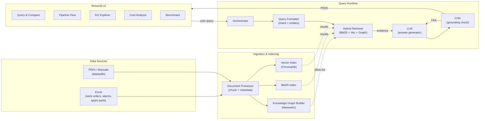
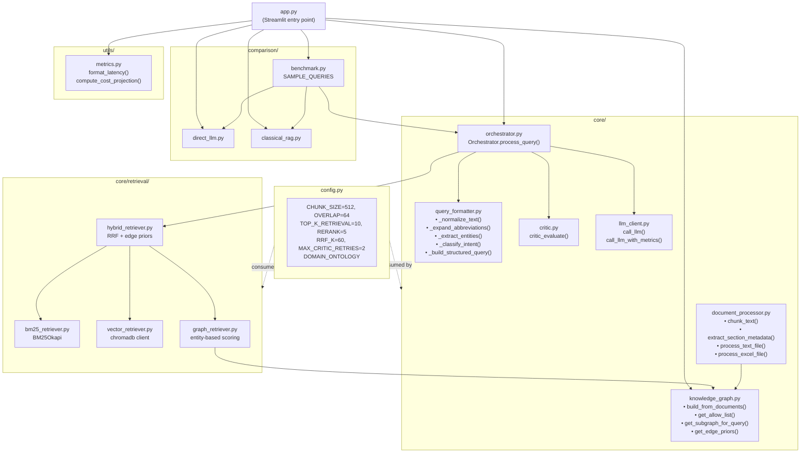
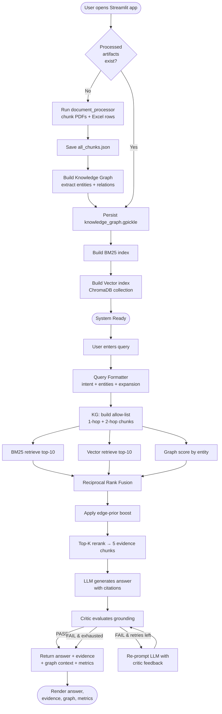
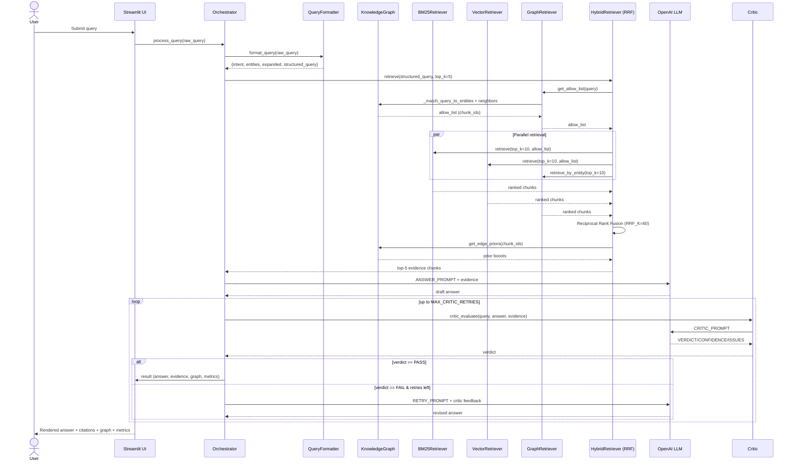
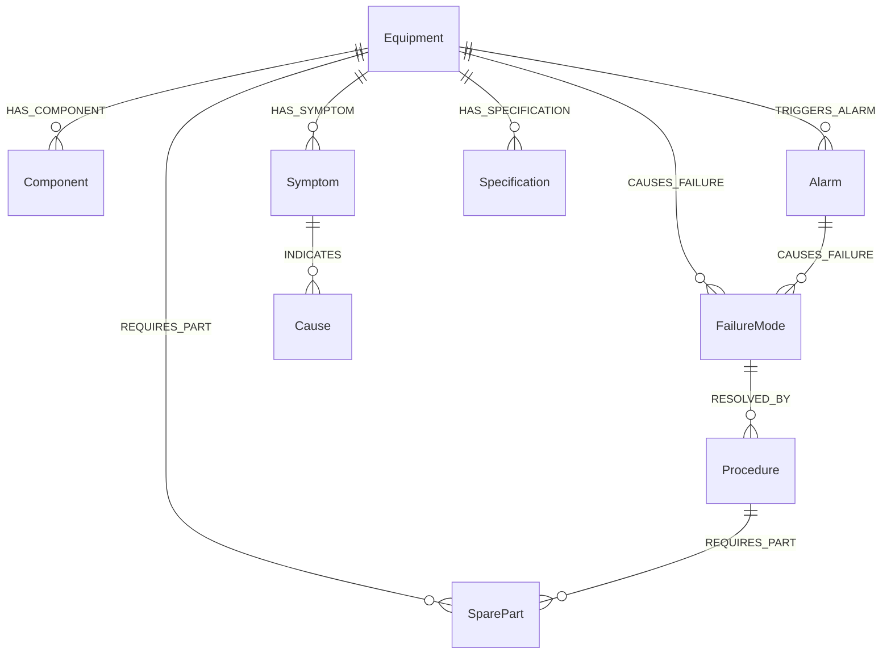
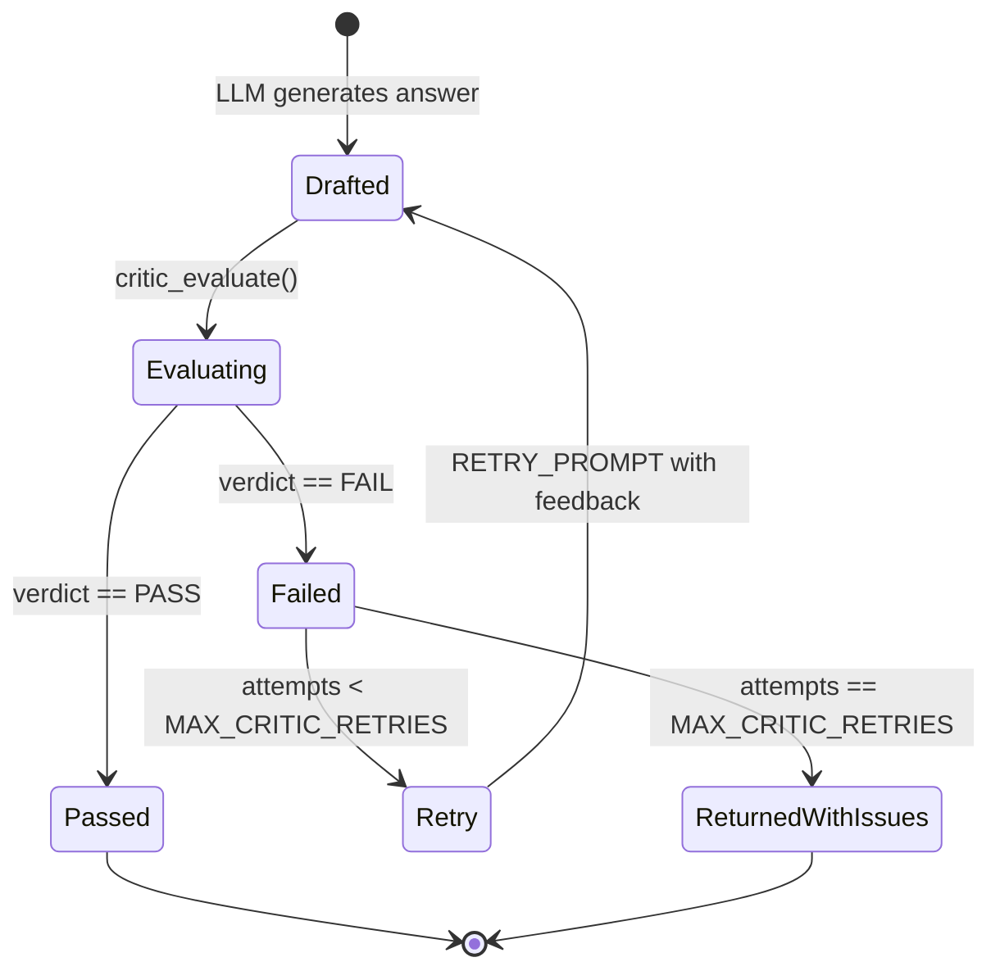

# Hybrid GraphRAG — Manufacturing Diagnostic Copilot

An **evidence-grounded** diagnostic and troubleshooting copilot for manufacturing equipment.
It combines **BM25 (sparse)**, **dense vector search**, and a **domain knowledge graph** with a
**critic-guided self-correction loop** to deliver auditable answers about pumps, conveyors,
hydraulic presses, PLCs, alarms, and spare parts — with full source citations.

The project ships with a Streamlit UI that lets you ask questions and **compare** three pipelines
side-by-side:

1. **Direct LLM** – no retrieval, no grounding (baseline)
2. **Classical RAG** – vector-only retrieval
3. **Hybrid GraphRAG** – BM25 + Vector + Graph + Critic loop (this project)

---

## Table of Contents

1. [Key Features](#key-features)
2. [Tech Stack](#tech-stack)
3. [High-Level Architecture](#high-level-architecture)
4. [Low-Level / Component Architecture](#low-level--component-architecture)
5. [End-to-End Activity Flow](#end-to-end-activity-flow)
6. [Pipeline Sequence Diagram](#pipeline-sequence-diagram)
7. [Knowledge Graph Schema](#knowledge-graph-schema)
8. [Retrieval Fusion Internals](#retrieval-fusion-internals)
9. [Critic Loop State Machine](#critic-loop-state-machine)
10. [Directory Structure](#directory-structure)
11. [Setup & Installation](#setup--installation)
12. [Running the Application](#running-the-application)
13. [Configuration](#configuration)
14. [Sample Queries](#sample-queries)
15. [Pipeline Comparison](#pipeline-comparison)
16. [Troubleshooting](#troubleshooting)

---

## Key Features

- **Three-way hybrid retrieval** — BM25 lexical + dense vectors (ChromaDB) + graph traversal
- **Domain knowledge graph** — Equipment, Components, Alarms, Symptoms, FailureModes, Procedures, SpareParts
- **Graph-scoped allow-list** — prunes candidate chunks to entities reachable in the KG
- **Reciprocal Rank Fusion (RRF)** with **edge-prior boosting**
- **Query understanding** — intent classification, entity extraction, abbreviation expansion (PLC, VFD, HMI, MTBF…)
- **Critic-driven self-correction** — LLM critic verifies grounding; rejected answers are regenerated (up to `MAX_CRITIC_RETRIES`)
- **Side-by-side benchmarking** UI vs Direct LLM and Classical RAG
- **Cost & ROI projection** dashboard
- **Full provenance** — every claim cited as `[source, chunk_id]`

---

## Tech Stack

| Layer            | Technology                                                  |
| ---------------- | ----------------------------------------------------------- |
| UI               | Streamlit + Plotly                                          |
| LLM              | OpenAI (`gpt-4o-mini` by default, configurable)             |
| Vector store     | ChromaDB (HNSW, cosine)                                     |
| Sparse retrieval | `rank-bm25`                                                 |
| Knowledge graph  | NetworkX (DiGraph)                                          |
| Embeddings       | Sentence-Transformers (`all-MiniLM-L6-v2`) via Chroma       |
| Data ingestion   | Pandas, openpyxl, pdfplumber                                |
| Language         | Python 3.10+                                                |

See `requirements.txt` for exact versions.

---

## High-Level Architecture



---

## Low-Level / Component Architecture



---

## End-to-End Activity Flow



---

## Pipeline Sequence Diagram



---

## Knowledge Graph Schema

The KG ontology is defined in `config.py → DOMAIN_ONTOLOGY` and built dynamically by
`core/knowledge_graph.py`.

### Entity Types

`Equipment`, `Component`, `Alarm`, `FailureMode`, `Symptom`, `Cause`, `Procedure`,
`SparePart`, `Specification`

### Relation Types

`HAS_COMPONENT`, `TRIGGERS_ALARM`, `CAUSES_FAILURE`, `HAS_SYMPTOM`, `RESOLVED_BY`,
`REQUIRES_PART`, `FOLLOWS_PROCEDURE`, `HAS_SPECIFICATION`



### Traversal Routes

| Route                 | Path                                                |
| --------------------- | --------------------------------------------------- |
| `symptom_to_fix`      | `Symptom → Cause → FailureMode → Procedure`         |
| `alarm_to_procedure`  | `Alarm → Equipment → FailureMode → Procedure`       |
| `equipment_to_parts`  | `Equipment → Component → SparePart`                 |

### ID Patterns recognised in text

| Type          | Regex                                  | Example           |
| ------------- | -------------------------------------- | ----------------- |
| Equipment     | `P-\d{3}`, `CV-\d{3}`, `HP-\d{3}`      | `P-203`, `CV-301` |
| Alarm         | `ALM-[A-Z]\d{3}`                       | `ALM-P001`        |
| Spare part    | `SP-\d{4}`                             | `SP-1042`         |
| Fault code    | `FC-\d{3}`                             | `FC-003`          |
| Work order    | `WO-\d{4}-\d{3}`                       | `WO-2024-117`     |

---

## Retrieval Fusion Internals

```mermaid
flowchart LR
    Q[Structured Query] --> AL[Graph Allow-List<br/>1-hop + 2-hop chunk_ids]

    AL --> B[BM25Retriever<br/>top-10]
    AL --> V[VectorRetriever<br/>ChromaDB top-10]
    Q  --> G[GraphRetriever<br/>entity score top-10]

    B --> RRF["RRF score =<br/>Σ 1 / (RRF_K + rank + 1)"]
    V --> RRF
    G --> RRF

    RRF --> EP[Edge-Prior Boost<br/>+= prior × 0.1]
    EP --> SORT[Sort by rrf_score desc]
    SORT --> TOP[Top-K rerank<br/>(TOP_K_RERANK=5)]
    TOP --> EVID[Final Evidence Chunks<br/>with text + metadata]
```

**Reciprocal Rank Fusion** (see `core/retrieval/hybrid_retriever.py`):

```python
rrf_score(c) = Σ over retrievers   1 / (RRF_K + rank(c, retriever) + 1)
```

After fusion, each chunk receives an additive boost proportional to the average prior of
graph edges touching that chunk — encoding "this relationship has been seen many times in
the corpus, so trust it more".

---

## Critic Loop State Machine



The critic checks 5 dimensions:

1. **Factual Grounding** — every claim traceable to a chunk
2. **Completeness** — does it address the question?
3. **Technical Accuracy** — IDs/codes match source
4. **Actionability** — concrete next steps for troubleshooting
5. **Safety** — proper warnings on safety-critical procedures

Output schema:

```
VERDICT: PASS | FAIL
CONFIDENCE: 0.0 – 1.0
ISSUES: <list or "None">
SUGGESTION: <how to fix on retry>
```

---

## Directory Structure

```
hybrid-graphrag-manufacturing/
├── app.py                        # Streamlit entry point
├── config.py                     # Central configuration + DOMAIN_ONTOLOGY
├── requirements.txt
├── .env.example                  # Template for OPENAI_API_KEY
│
├── core/                         # Core pipeline
│   ├── document_processor.py     # Chunking + metadata extraction
│   ├── knowledge_graph.py        # NetworkX KG (build / query / persist)
│   ├── query_formatter.py        # Intent + entity + abbreviation expansion
│   ├── orchestrator.py           # End-to-end pipeline driver
│   ├── critic.py                 # LLM critic + verdict parser
│   ├── llm_client.py             # OpenAI wrapper + cost accounting
│   └── retrieval/
│       ├── bm25_retriever.py     # Sparse lexical (rank-bm25)
│       ├── vector_retriever.py   # Dense (ChromaDB)
│       ├── graph_retriever.py    # Entity-driven graph scoring
│       └── hybrid_retriever.py   # RRF + edge priors
│
├── comparison/                   # Baselines for benchmarking
│   ├── direct_llm.py             # No retrieval baseline
│   ├── classical_rag.py          # Vector-only RAG
│   └── benchmark.py              # SAMPLE_QUERIES + comparison runner
│
├── utils/
│   └── metrics.py                # Latency/cost formatting, projections
│
├── data/
│   ├── pdfs/                     # Source manuals (.txt placeholders)
│   ├── excel/                    # work_orders.xlsx, alarm_history.xlsx, …
│   └── processed/                # all_chunks.json, knowledge_graph.gpickle
│
└── static/                       # (reserved for static assets)
```

---

## Setup & Installation

### Prerequisites

- Python 3.10 or newer
- macOS / Linux / WSL (Windows native should work but is not tested)
- An OpenAI API key (optional — without it the app degrades but won't crash on indexing)

### 1. Clone & enter the project

```bash
cd hybrid-graphrag-manufacturing
```

### 2. Create a virtual environment

```bash
python3 -m venv .venv
source .venv/bin/activate          # Windows: .venv\Scripts\activate
```

### 3. Install dependencies

```bash
pip install --upgrade pip
pip install -r requirements.txt
```

### 4. Configure environment variables

```bash
cp .env.example .env
# then edit .env and set OPENAI_API_KEY=sk-...
```

`.env` keys:

| Key               | Default              | Purpose                              |
| ----------------- | -------------------- | ------------------------------------ |
| `OPENAI_API_KEY`  | _(empty)_            | Required for live answers + critic   |
| `LLM_MODEL`       | `gpt-4o-mini`        | Any chat-completion compatible model |
| `EMBEDDING_MODEL` | `all-MiniLM-L6-v2`   | Sentence-Transformers model name     |

---

## Running the Application

### Option A — Launch the Streamlit UI (recommended)

```bash
streamlit run app.py
```

Streamlit will print a local URL (typically `http://localhost:8501`). Open it in your browser.

On the first launch the app will:

1. Process `data/pdfs/*.txt` and `data/excel/*.xlsx` into `data/processed/all_chunks.json`.
2. Build the knowledge graph and write `data/processed/knowledge_graph.gpickle`.
3. Build BM25 + ChromaDB indexes (kept in memory).

Subsequent launches load cached artifacts and start in seconds.

### Option B — Run from Python (programmatic)

```python
from core.document_processor import process_all_documents
from core.knowledge_graph import KnowledgeGraph
from core.orchestrator import Orchestrator

docs = process_all_documents()
kg = KnowledgeGraph()
if not kg.load():
    kg.build_from_documents(docs)

orc = Orchestrator(docs, kg)
orc.initialize()

result = orc.process_query(
    "Pump P-203 has high vibration alarm ALM-P001. What is the likely cause and fix?"
)
print(result["answer"])
print("Citations:", [c["chunk_id"] for c in result["evidence"]])
print("Critic verdict:", result["critic"]["final_verdict"]["verdict"])
```

### Option C — Run the built-in benchmark suite

```python
from comparison.benchmark import run_benchmark, SAMPLE_QUERIES
from comparison.classical_rag import ClassicalRAG
# (reuse `orc` and `docs` from option B)

classical = ClassicalRAG(docs); classical.initialize()
report = run_benchmark(orc, classical, queries=SAMPLE_QUERIES)
print(report["summary"])
```

Or run it interactively via the **📋 Benchmark** tab in the UI.

### Re-indexing

Click **🔄 Re-index All Data** in the sidebar, or delete `data/processed/` and relaunch.

---

## Configuration

All knobs live in `config.py`:

| Setting              | Default | Effect                                                |
| -------------------- | ------- | ----------------------------------------------------- |
| `CHUNK_SIZE`         | 512     | Approx words per chunk                                |
| `CHUNK_OVERLAP`      | 64      | Sentence overlap between chunks                       |
| `TOP_K_RETRIEVAL`    | 10      | Candidates from each retriever                        |
| `TOP_K_RERANK`       | 5       | Final evidence chunks shown to the LLM                |
| `RRF_K`              | 60      | RRF damping constant                                  |
| `MAX_CRITIC_RETRIES` | 2       | Max regeneration attempts after a failed critic check |
| `CHROMA_COLLECTION`  | `manufacturing_docs` | ChromaDB collection name                |

Domain ontology (entity / relation types and traversal routes) is also in `config.py` under
`DOMAIN_ONTOLOGY` — extend it to add new equipment classes.

---

## Sample Queries

The UI sidebar offers one-click samples from `comparison/benchmark.py → SAMPLE_QUERIES`:

| Category       | Difficulty | Example                                                                    |
| -------------- | ---------- | -------------------------------------------------------------------------- |
| troubleshoot   | medium     | _"Pump P-203 has high vibration alarm ALM-P001. Likely cause and fix?"_    |
| troubleshoot   | medium     | _"Belt tracking deviation on conveyor CV-301. ALM-C002 triggered."_        |
| troubleshoot   | hard       | _"Hydraulic press HP-401 pressure loss. Cycle time up 40%."_               |
| procedure      | easy       | _"PM schedule for pump P-201 mechanical seal?"_                            |
| inventory      | easy       | _"Spare parts needed for bearing replacement on P-203?"_                   |
| alarm          | hard       | _"PLC fault FC-003 on CV-302. Communication loss with VFD."_               |
| specification  | easy       | _"Max operating pressure for HP-402 hydraulic system?"_                    |
| troubleshoot   | hard       | _"ALM-P003 seal leak on P-202 AND ALM-P001 vibration on P-203. Related?"_  |

---

## Pipeline Comparison

| Capability             | Direct LLM | Classical RAG | **Hybrid GraphRAG** |
| ---------------------- | ---------- | ------------- | ------------------- |
| Retrieval              | none       | Vector only   | BM25 + Vector + Graph |
| Knowledge graph        | ❌         | ❌            | ✅                  |
| Query understanding    | basic      | basic         | intent + entity     |
| Evidence grounding     | none       | partial       | full, chunk-level   |
| Self-correction        | ❌         | ❌            | ✅ critic loop      |
| Citations              | ❌         | partial       | `[source, chunk_id]` |
| ID / jargon handling   | poor       | limited       | excellent (graph-aware) |
| Audit trail            | ❌         | limited       | full pipeline trace |
| Est. answer accuracy¹  | ~45%       | ~60%          | ~85%                |
| Est. hallucination¹    | ~40%       | ~25%          | ~8%                 |

¹ Heuristic estimates from `utils/metrics.py`, used to power the UI cost-projection charts.

---

## Troubleshooting

| Symptom                                              | Fix                                                                         |
| ---------------------------------------------------- | --------------------------------------------------------------------------- |
| `OPENAI_API_KEY` errors                              | Edit `.env` and restart `streamlit`                                         |
| `chromadb` errors about existing collection          | Click **🔄 Re-index All Data** in the sidebar                               |
| "No graph entities matched this query"               | Include explicit IDs like `P-203`, `ALM-P001`, `SP-1042` in the query       |
| First launch is slow                                 | Expected — indexes build once and are cached under `data/processed/`        |
| Critic always returns FAIL                           | Confirm `OPENAI_API_KEY` works and `LLM_MODEL` supports chat completions    |
| Excel/PDF not picked up                              | Place files in `data/pdfs/` (`.txt`) or `data/excel/` (`.xlsx`) and re-index |

---

## License

Internal / proprietary. See your organisation's licensing policy before redistributing.
